# Quy Trình Phát Triển Tính Năng Toàn Diện (Feature Delivery SOP) — AstroBite

Tài liệu này chuẩn hóa **Quy trình Phát triển Tính năng Khép kín (End-to-End Feature Delivery SOP)** từ lúc nảy sinh ý tưởng cho đến khi phát hành ra người dùng, kết hợp chặt chẽ giữa 3 vai trò **BA ➔ QA ➔ FE Dev** trên kiến trúc **Git Submodules**.

---

## 🧭 Sơ Đồ Quy Trình 5 Cổng Chất Lượng (5-Gate Delivery Flow)

```mermaid
flowchart TD
    Idea([💡 Ý Tưởng Tính Năng Mới]) --> Gate1
    
    subgraph Cổng 1: Phân Tích Nghiệp Vụ [CỔNG 1: BA Gate - docs/]
        Gate1[BA phân tích & viết PRD]
        US[Viết User Stories chuẩn BDD]
        Data[Cập nhật Từ điển Dữ liệu]
        Gate1 --> US --> Data
    end
    
    Data -->|Review & Approve PRD| Gate2
    
    subgraph Cổng 2: Thiết Kế Kiểm Thử [CỔNG 2: QA Gate - tests/]
        Gate2[QA đọc PRD & Stories]
        TC[Thiết kế Testcase Thủ công]
        BDD[Viết kịch bản Gherkin .feature]
        Gate2 --> TC --> BDD
    end
    
    BDD -->|Traceability Matrix 100%| Gate3
    
    subgraph Cổng 3: Phát Triển Mã Nguồn [CỔNG 3: Dev Gate - frontend/]
        Gate3[FE Dev đọc PRD & BDD]
        CleanArch[Xây dựng Clean Architecture: Domain -> Data -> Presentation]
        UnitTest[Viết Unit & Widget Test]
        Gate3 --> CleanArch --> UnitTest
    end
    
    UnitTest -->|flutter analyze & test PASS| Gate4
    
    subgraph Cổng 4: Kiểm Thử Tự Động & Nghiệm Thu [CỔNG 4: Verification Gate]
        Gate4[Chạy E2E Integration Test]
        ManualQA[QA test trên thiết bị thật]
        SignOff[Lập Biên bản Nghiệm thu Sign-off]
        Gate4 --> ManualQA --> SignOff
    end
    
    SignOff -->|Sign-off Approved| Gate5
    
    subgraph Cổng 5: Đóng Gói & Phát Hành [CỔNG 5: Super-Repo Release]
        Gate5[Chạy make update tại Root]
        CommitPin[Commit con trỏ Submodules]
        GitTag[Tạo Tag phiên bản vX.Y.Z]
        Gate5 --> CommitPin --> GitTag
    end
    
    GitTag --> Release([🚀 Hoàn Tất Phát Hành])
```



---

## 🚪 Chi Tiết 5 Cổng Chất Lượng (Quality Gates)

### 🔹 CỔNG 1: Phân Tích Nghiệp Vụ (BA Gate)
- **Thư mục làm việc**: `docs/` (Submodule `astrobite-ba-docs`).
- **Skill hỗ trợ**: `business-analyst`.
- **Nhiệm vụ cụ thể**:
  1. Tạo thư mục `docs/03-prd-features/<id>-<feature>/`.
  2. Viết `prd-<feature>.md` (Bối cảnh, User Personas, KPIs, User Flow).
  3. Viết `user-stories.md` kèm Acceptance Criteria chuẩn BDD (`Given - When - Then`).
  4. Viết `ui-ux-screen-specs.md` (Layout, Màu sắc Celestial Dark, Spacing 4pt).
  5. Cập nhật thực thể mới vào `docs/04-specifications/data-dictionary.md`.
- **Tiêu chí vượt cổng (Exit Criteria)**: PO và Tech Lead phê duyệt PRD và User Stories.

---

### 🔹 CỔNG 2: Thiết Kế Kiểm Thử (QA Gate)
- **Thư mục làm việc**: `tests/` (Submodule `astrobite-testcases`).
- **Skill hỗ trợ**: `qa-tester`.
- **Nhiệm vụ cụ thể**:
  1. Tạo thư mục `tests/02-manual-testcases/<id>-<feature>/`.
  2. Viết các file `TC-<feature>-*.md` bao phủ:
     - **Happy Path**: Luồng người dùng chuẩn.
     - **Boundary & Negative**: Giá trị biên, nhập sai, ngắt kết nối mạng.
  3. Soạn thảo kịch bản BDD tại `tests/03-bdd-gherkin-scenarios/<feature>.feature` (Cú pháp Gherkin khớp từng câu chữ với Acceptance Criteria của BA).
- **Tiêu chí vượt cổng (Exit Criteria)**: Độ bao phủ kiểm thử (Test Coverage) đạt 100% User Stories của BA.

---

### 🔹 CỔNG 3: Phát Triển Mã Nguồn (Frontend Dev Gate)
- **Thư mục làm việc**: `frontend/` (Submodule `astrobite-frontend`).
- **Skill hỗ trợ**: `flutter-expert`.
- **Nhiệm vụ cụ thể**:
  1. Tạo nhánh Git: `feat/<feature>`.
  2. Đọc yêu cầu từ `docs/` và kịch bản BDD từ `tests/`.
  3. Triển khai theo **Feature-First Clean Architecture** (`frontend/lib/features/<feature>/`):
     - **Domain**: Entity (`@freezed`), Value Objects, Abstract Repositories.
     - **Data**: Data Sources (Firestore/Storage/Gemini), DTOs, Repository Implementation.
     - **Presentation**: Controllers (`@riverpod`), Screens (`@RoutePage`), Custom Widgets.
  4. Tuân thủ nghiêm ngặt Design Tokens trong `lib/core/theme/app_colors.dart` (Carbs `#1A73E8`, Fat `#FF69B4`, Protein `#FFD700`, Surface `#0A192F`).
- **Tiêu chí vượt cổng (Exit Criteria)**:
  - `flutter analyze` đạt 0 lỗi, 0 cảnh báo.
  - Code sạch theo Clean Architecture, không bypass App Check.

---

### 🔹 CỔNG 4: Kiểm Thử Tự Động & Nghiệm Thu (Verification Gate)
- **Thư mục làm việc**: `frontend/test/`, `frontend/integration_test/`, `tests/`.
- **Skill hỗ trợ**: `flutter-testing` & `qa-tester`.
- **Nhiệm vụ cụ thể**:
  1. Viết Unit Test & Widget Test tại `frontend/test/features/<feature>/`.
  2. Chuyển kịch bản Gherkin từ `tests/03-bdd-gherkin-scenarios/<feature>.feature` thành mã kiểm thử E2E tại `frontend/integration_test/<feature>_flow_test.dart`.
  3. Chạy kiểm tra tự động:
     ```bash
     flutter test
     ```
  4. QA cài đặt bản build staging trên thiết bị thật (iOS & Android) kiểm tra:
     - Chức năng theo Testcase.
     - Hiệu năng (FPS 55-60, Cold start <= 1.8s, AI latency <= 2.5s).
     - Khả năng ngoại tuyến (Offline persistence).
  5. Điền biên bản nghiệm thu tại `tests/05-test-execution-reports/release-sign-offs/signoff-<feature>.md`.
- **Tiêu chí vượt cổng (Exit Criteria)**:
  - 100% Automated Tests Pass.
  - Không còn Bug mức S1 (Blocker) hoặc S2 (Critical).
  - QA Lead và PO đã ký duyệt biên bản nghiệm thu.

---

### 🔹 CỔNG 5: Tích Hợp Super-Repo & Phát Hành (Release Gate)
- **Thư mục làm việc**: Root Super-Repo `AstroBite/`.
- **Nhiệm vụ cụ thể**:
  1. Đảm bảo PR của cả 3 submodule đã được merge vào nhánh `main` tương ứng.
  2. Tại thư mục gốc `AstroBite`, đồng bộ toàn bộ workspace:
     ```bash
     make update
     ```
  3. Kiểm tra hồi quy toàn diện:
     ```bash
     make test-fe
     make status
     ```
  4. Cập nhật con trỏ commit của các submodule tại Root:
     ```bash
     git add docs tests frontend
     git commit -m "feat(release): ship <feature-name> (specs, testcases, frontend)"
     git push origin main
     ```
  5. Gắn Tag phiên bản phát hành:
     ```bash
     git tag -a vX.Y.Z -m "Release vX.Y.Z: Added <feature-name>"
     git push origin vX.Y.Z
     ```
- **Tiêu chí vượt cổng (Exit Criteria)**: Root repo chứa đúng con trỏ commit của phiên bản đã nghiệm thu; mã nguồn sẵn sàng build CI/CD đẩy lên App Store và Google Play.

---

## 📊 Bảng Đối Soát Trách Nhiệm (RACI across Gates)

| Hoạt động | BA | QA | FE Dev | PO / Release Lead |
| :--- | :---: | :---: | :---: | :---: |
| **Cổng 1: PRD & BDD Stories** | **R / A** | C | C | A |
| **Cổng 2: Testcases & Kịch bản Gherkin** | C | **R / A** | I | I |
| **Cổng 3: Clean Architecture Frontend** | I | C | **R / A** | I |
| **Cổng 4: Test E2E & Nghiệm Thu Sign-off** | I | **R** | C | **A** |
| **Cổng 5: Merge Super-repo & Gắn Tag** | I | I | C | **R / A** |
