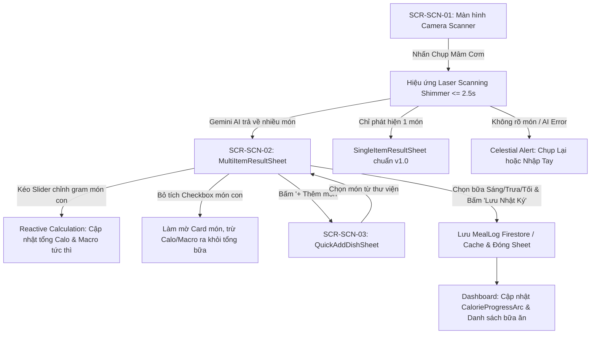

# Đặc Tả Thiết Kế Giao Diện (UI/UX Design Spec): Nhận Diện Đa Món Ăn Bằng AI (Multi-Item Food Scanner)

> **Mã tính năng**: `FEAT-06` (Multi-Item Meal Detection)  
> **Thuộc Cổng**: Gate 2 (Mobile UI/UX Design Gate)  
> **Sub-Agent Thiết kế**: `ui-ux-designer`  
> **Tài liệu tham chiếu**: [PRD FEAT-06](file:///Users/nguyenduytrang/flutter_project/AstroBite/docs/03-prd-features/06-multi-item-scanner/prd-multi-item-scanner.md), [User Stories FEAT-06](file:///Users/nguyenduytrang/flutter_project/AstroBite/docs/03-prd-features/06-multi-item-scanner/user-stories.md), Design System ([`DESIGN.md`](file:///Users/nguyenduytrang/flutter_project/AstroBite/DESIGN.md))  
> **Trạng thái**: 🟢 **Đã Nghiệm Thu Gate 2 (BA & PO Signed Off)**  

---

## 1. Danh Sách Màn Hình & Sơ Đồ Điều Hướng (Navigation Flow)

### 1.1. Bảng Danh Mục Màn Hình & Thành Phần UI
| Mã Màn Hình | Tên Màn Hình / Thành Phần | Tuyến Đường (AutoRoute) | Bối Cảnh & Mục Đích Sử Dụng |
| :---: | :--- | :--- | :--- |
| `SCR-SCN-01` | `FoodScannerPage` (Mở rộng Camera View) | `/scanner` | Màn hình Camera chụp ảnh mâm cơm với khung quét Laser đa điểm |
| `SCR-SCN-02` | `MultiItemResultSheet` (Bottom Sheet) | `ModalBottomSheet` | Hiển thị bảng tổng hợp dinh dưỡng và danh sách bóc tách từng món con |
| `SCR-SCN-03` | `QuickAddDishSheet` (Thêm món con) | `ModalBottomSheet` | Cho phép tra cứu nhanh để thêm món ăn bị AI bỏ sót vào mâm cơm |

### 1.2. Sơ Đồ Luồng Tương Tác Người Dùng (Mermaid Navigation Flow)

---

## 2. Blueprint Bố Cục & Thông Số Lưới 4pt (Screen Layout Blueprints)

### 2.1. Cấu Trúc BottomSheet `SCR-SCN-02: MultiItemResultSheet`
- **Chiều cao Sheet**: `85% Screen Height`, hỗ trợ kéo vuốt (DraggableScrollableSheet).
- **Lớp phủ nền (Background)**: `AppColors.surfaceBlur` (`rgba(25, 42, 70, 0.75)`) kết hợp `BackdropFilter(sigmaX: 20, sigmaY: 20)`.
- **Viền trên (Border)**: Bo góc `24pt`, viền ánh sao `1px solid rgba(255, 255, 255, 0.1)`.

#### A. Thanh Kéo & Tiêu Đề (Header Section - 56pt)
- **Thanh trượt (Drag Handle)**: Kích thước `36 × 4pt`, bo góc `2pt`, màu `AppColors.outline` (`#495670`), căn giữa.
- **Tiêu đề Sheet**: Font Inter Bold `20pt` (`#FFFFFF`), kèm nút đóng `CloseButton` góc phải (vùng chạm `44 × 44pt`).

#### B. Thẻ Tổng Hợp Dinh Dưỡng Bữa Ăn (Meal Summary GlassCard)
- **Container**: `GlassCard`, padding `16pt`, bo góc `16pt`, nền `#112240` (SurfaceContainer).
- **Hàng 1**:
  - Nhãn: *"Tổng Năng Lượng"* (Inter Medium `14pt`, `#8892B0`).
  - Số Calo tổng: Font Inter Bold `28pt`, màu vàng ánh kim `AppColors.tertiary` (`#FFD700`), `letterSpacing: +0.5`.
- **Hàng 2 - MacroBar tổng**:
  - Thanh hiển thị tỷ lệ Carbs (`#1A73E8`), Fat (`#FF69B4`), Protein (`#FFD700`) chiều cao `8pt`, bo tròn `4pt`.
- **Hàng 3 - Bộ chọn bữa ăn (MealTypeSelector)**:
  - 4 chips: Sáng, Trưa, Tối, Phụ. Chiều cao chip `36pt`, vùng chạm `44pt`, chip được chọn có viền phát sáng `#1A73E8`.

#### C. Danh Sách Thẻ Món Ăn Con (Dish Cards List)
- **Khoảng cách giữa các thẻ (Item Spacing)**: `12pt`.
- **Cấu trúc mỗi Dish Card (`DishItemCard`)**:
  - **Nền thẻ**: `AppColors.surfaceContainer` (`#112240`), bo góc `12pt`, padding `12pt`.
  - **Trạng thái Active**: Opacity 1.0, viền mảnh `rgba(255,255,255,0.08)`.
  - **Trạng thái Unselected**: Opacity 0.4, chuyển sang tông xám, các chỉ số calo bị gạch ngang mờ.
  - **Thành phần trong thẻ**:
    1. **Hàng đầu**:
       - `Checkbox` tùy biến Celestial: Vùng chạm `44 × 44pt`, khi tích có icon xanh `#1A73E8`.
       - Tên món ăn: Font Inter Bold `16pt`, màu `#FFFFFF`, tự động ngắt dòng.
       - Badge độ tin cậy AI: Nền `rgba(26,115,232,0.15)`, chữ xanh `#1A73E8`, font `11pt` (vd: `92%`).
       - Nút xóa món: Icon thùng rác góc phải, vùng chạm `44 × 44pt`.
    2. **Hàng thứ hai (Thông số dinh dưỡng)**:
       - Trọng lượng hiện tại: Font Inter Bold `15pt` (vd: `150g`).
       - Calo tương ứng: Font Inter Bold `15pt` (vd: `234 kcal`).
       - Mini Macro Chips: Carbs `32g` (chấm xanh), Fat `8g` (chấm hồng), Protein `12g` (chấm vàng).
    3. **Hàng thứ ba (Slider điều chỉnh gram)**:
       - Thanh Slider trơn tru, dải giá trị từ `20g` đến `800g`, bước nhảy `5g`.
       - Chiều cao thanh trượt `44pt` (đạt chuẩn Touch Target). Khi kéo, số gram và calo nhảy số mượt mà 60 FPS.

#### D. Nút Thêm Món Bị Bỏ Sót & CTA Lưu Bữa Ăn
- **Nút `"+ Thêm món thủ công"`**: Dạng Outlined Button, chiều cao `44pt`, viền nét đứt `#1A73E8`, chữ màu `#1A73E8` Inter SemiBold `14pt`.
- **Nút CTA Lưu Nhật Ký (Bottom Sticky CTA)**:
  - Chiều cao `52pt`, bo góc `16pt`, nền Gradient Electric Blue `AppColors.primary` (`#1A73E8`).
  - Chữ: *"Lưu Bữa Ăn (X Món • Y Kcal)"* — Inter Bold `16pt`, màu trắng.
  - Vùng đệm đáy: `SafeArea(bottom: true)` với padding `16pt`.

---

## 3. Đặc Tả 5 Trạng Thái Giao Diện Bắt Buộc (The 5 Essential States)

| Trạng Thái | Mô Tả Hành Vi Giao Diện | Quy Chuẩn Trực Quan (Visual Specs) |
| :--- | :--- | :--- |
| **1. Default (Đa món đầy đủ)** | Hiển thị 2 - 6 món ăn đã nhận diện kèm tổng calo phản ứng tức thì. | Toàn bộ thẻ hiển thị rõ nét trên nền `#0A192F`, thanh slider và checkbox tương tác mượt mà. |
| **2. Loading (Laser Scanning)** | Đang phân tích ảnh qua Gemini 2.0 Flash Vision (thời gian <= 2.5s). | Khung ngắm Scanning Viewfinder với vệt laser xanh neon quét lên xuống, kết hợp 3 khối Skeleton Shimmer chu kỳ 1.5s. |
| **3. Empty (Ảnh không có đồ ăn)** | Ảnh chụp bàn trống, đồ vật hoặc phong cảnh (`isFood == false`). | Biểu tượng dĩa bay thiên hà minh họa, thông điệp: *"Không tìm thấy món ăn trong ảnh. Hãy hướng camera vào đĩa cơm và thử lại nhé!"*, 2 nút: [Chụp lại] & [Nhập tay]. |
| **4. Error (AI Timeout / Mất mạng)** | Lỗi quá tải mạng hoặc Gemini Vision API gặp sự cố. | Viền thẻ cảnh báo ấm áp, thông điệp tiếng Việt: *"Kết nối máy chủ bị gián đoạn. Ảnh đã được lưu tạm, bạn có thể thử lại ngay."*, nút [Thử lại ngay]. |
| **5. Offline (Ngoại tuyến)** | Người dùng mở camera quét khi không có kết nối Internet. | BottomSheet hiển thị thông báo: *"Tính năng Quét AI cần Internet để phân tích. Bạn có thể chụp lưu máy hoặc Nhập món thủ công ngay."*, nút chuyển nhanh sang Manual Entry. |

---

## 4. Bảng Ánh Xạ Token Celestial Dark UI (Design Token Mapping)

| Thành Phần Giao Diện | M3 Token / AppColors | Giá Trị Hex / RGB | Mục Đích Dinh Dưỡng & Ngữ Nghĩa |
| :--- | :--- | :--- | :--- |
| Nền toàn màn hình Camera | `AppColors.surface` | `#0A192F` | Nền đêm sâu thẳm, dịu mắt |
| Nền BottomSheet kính mờ | `AppColors.surfaceBlur` | `rgba(25, 42, 70, 0.75)` | Hiệu ứng mờ không gian sâu |
| Thẻ tổng quan & Thẻ món con | `AppColors.surfaceContainer` | `#112240` | Khối thẻ chính, bo góc 12-16px |
| Checkbox & Thanh CTA chính | `AppColors.primary` | `#1A73E8` | Chỉ số Tinh bột (Carbs) & Nút hành động |
| Chấm chỉ báo Chất béo | `AppColors.secondary` | `#FF69B4` | Chỉ báo Chất béo (Fat) |
| Số Calo tổng & Chấm Đạm | `AppColors.tertiary` | `#FFD700` | Chỉ số Chất đạm (Protein) & Calo nổi bật |
| Chữ chính (Tên món, Calo) | `AppColors.onSurface` | `#FFFFFF` | Tương phản cao, dễ đọc |
| Chữ phụ (Gram, Phân loại) | `AppColors.onSurfaceVariant` | `#8892B0` | Tông màu xám xanh dịu nhẹ |
| Đường viền ngăn cách thẻ | `AppColors.outline` | `#495670` | Vạch phân cách tinh tế |

---

## 5. Handoff Specs & Kỷ Luật Ponytail Cho Dev FE

> [!IMPORTANT]
> Dev FE bắt buộc phải tái sử dụng các component có sẵn trong `shared/widgets/`, tuyệt đối không tạo thêm widget thừa.

1. **Thành phần tái sử dụng bắt buộc**:
   - `GlassCard`: Container cho Meal Summary và DishItemCard.
   - `MacroBar`: Thanh phân bổ Carbs / Fat / Protein tổng.
   - `MealTypeChip`: Bộ chọn bữa ăn Sáng / Trưa / Tối / Phụ.
   - `SkeletonLoader`: Hiển thị placeholder khi đang đợi AI phân tích.
2. **Kỷ luật Ponytail**:
   - Sử dụng `ListView.separated` tiêu chuẩn Flutter cho danh sách món ăn, không bọc lồng SingleChildScrollView gây drop FPS.
   - State management: Quản lý trạng thái đa món bằng `StateNotifier` / `@riverpod` độc lập (`multiScanResultProvider`).
   - Định dạng hiển thị calo luôn có `letterSpacing: 0.5` để số liệu không bị dính nét.
