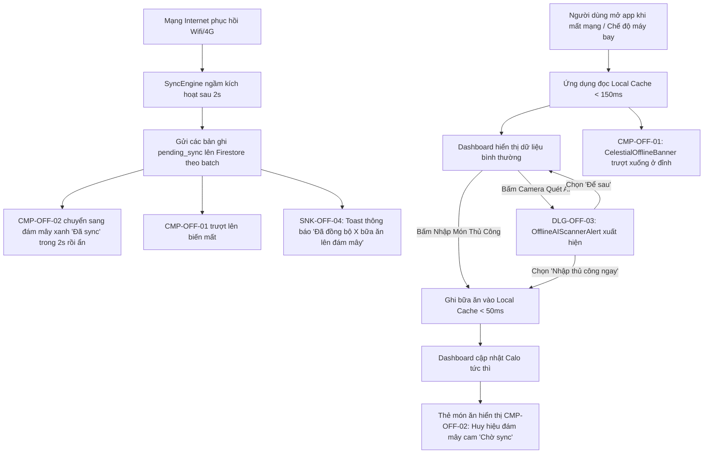

# Đặc Tả Thiết Kế Giao Diện (UI/UX Design Spec): Trải Nghiệm Ngoại Tuyến & Tự Động Đồng Bộ (Offline-First Resilience)

> **Mã tính năng**: `FEAT-07` (Offline-First Local Cache & Sync)  
> **Thuộc Cổng**: Gate 2 (Mobile UI/UX Design Gate)  
> **Sub-Agent Thiết kế**: `ui-ux-designer`  
> **Tài liệu tham chiếu**: [PRD FEAT-07](file:///Users/nguyenduytrang/flutter_project/AstroBite/docs/03-prd-features/07-offline-sync-resilience/prd-offline-sync.md), [User Stories FEAT-07](file:///Users/nguyenduytrang/flutter_project/AstroBite/docs/03-prd-features/07-offline-sync-resilience/user-stories.md), Design System ([`DESIGN.md`](file:///Users/nguyenduytrang/flutter_project/AstroBite/DESIGN.md))  
> **Trạng thái**: 🟢 **Đã Nghiệm Thu Gate 2 (BA & PO Signed Off)**  

---

## 1. Danh Sách Màn Hình & Sơ Đồ Điều Hướng (Navigation Flow)

### 1.1. Bảng Danh Mục Thành Phần UI Ngoại Tuyến
| Mã UI Component | Tên Thành Phần / Dialog / Banner | Vị Trí Hiển Thị | Bối Cảnh & Mục Đích Sử Dụng |
| :---: | :--- | :--- | :--- |
| `CMP-OFF-01` | `CelestialOfflineBanner` (Thanh thông báo) | Đỉnh màn hình dưới AppBar | Xuất hiện khi ngắt mạng, thông báo đang dùng dữ liệu ngoại tuyến |
| `CMP-OFF-02` | `SyncStatusBadge` (Huy hiệu đồng bộ) | Góc phải trên từng thẻ MealCard | Biểu thị trạng thái: Chờ sync (cam), Đã sync (xanh), Lỗi (đỏ) |
| `DLG-OFF-03` | `OfflineAIScannerAlert` (Hộp thoại chỉ dẫn) | Dialog phủ mờ màn hình | Xuất hiện khi người dùng bấm Quét AI lúc đang offline, hướng dẫn nhập tay |
| `SNK-OFF-04` | `SyncSuccessToast` (Toast thông báo) | Đáy màn hình (SnackBar) | Thông báo nhẹ khi các bữa ăn offline đã tự động đồng bộ lên Firestore |

### 1.2. Sơ Đồ Luồng Tương Tác Trạng Thái Mạng (Mermaid Navigation Flow)

---

## 2. Blueprint Bố Cục & Thông Số Lưới 4pt (Component Layout Blueprints)

### 2.1. Thanh Cảnh Báo Ngoại Tuyến `CMP-OFF-01: CelestialOfflineBanner`
- **Vị trí**: Cố định ngay dưới Top AppBar, trải dài toàn chiều rộng màn hình.
- **Chiều cao**: `36pt`, hiệu ứng trượt mượt mà (SlideTransition + Fade, duration `300ms`).
- **Nền (Background)**: Hổ phách thiên hà ánh mờ `rgba(255, 171, 0, 0.15)` kết hợp viền đáy `1px solid rgba(255, 171, 0, 0.3)`.
- **Thành phần bên trong**:
  - Icon: Biểu tượng wifi gạch chéo (`Icons.wifi_off_rounded`), kích thước `16 × 16pt`, màu `#FFAB00`.
  - Văn bản: *"Chế độ ngoại tuyến — Dữ liệu đang được lưu an toàn trên máy"* — Font Inter Medium `12pt`, màu `#FFE082`.
  - Vùng đệm: Padding trái/phải `16pt`, padding trên/dưới `8pt`.

### 2.2. Huy Hiệu Trạng Thái Đồng Bộ `CMP-OFF-02: SyncStatusBadge`
- **Vị trí**: Tọa độ góc trên bên phải của `MealCard` hoặc `DishItemCard`.
- **Kích thước**: `24 × 24pt`, vùng chạm tương tác `44 × 44pt` (khi bấm vào hiển thị tooltip giải thích).
- **3 Trạng thái huy hiệu**:
  1. **Chờ đồng bộ (`pending_sync`)**:
     - Icon: Đám mây nhỏ kèm chấm tròn phát sáng nhẹ (Pulsing Dot).
     - Màu sắc: Hổ phách ấm `#FFAB00` (`AppColors.tertiary`).
     - Tooltip: *"Bữa ăn này đang lưu trên thiết bị. Sẽ tự tải lên khi có mạng."*
  2. **Đã đồng bộ (`synced`)**:
     - Icon: Đám mây có dấu tích chữ V bên trong (`Icons.cloud_done_rounded`).
     - Màu sắc: Xanh ngọc bích sáng `#00E676`.
     - Hành vi: Hiển thị trong 2 giây sau khi đồng bộ thành công rồi tự động mờ dần và biến mất hoàn toàn để giữ màn hình gọn gàng.
  3. **Lỗi đồng bộ (`failed`)**:
     - Icon: Đám mây có dấu chấm than (`Icons.cloud_off_rounded`).
     - Màu sắc: Đỏ cảnh báo `#FF5252`.
     - Tooltip: *"Chưa thể tải lên máy chủ. Chạm vào đây để thử lại."*

### 2.3. Hộp Thoại Hướng Dẫn Ngoại Tuyến `DLG-OFF-03: OfflineAIScannerAlert`
- **Hình thức**: Celestial Dialog bo góc `20pt`, nền `AppColors.surfaceContainer` (`#112240`), viền ánh sao `1px solid rgba(255,255,255,0.1)`.
- **Nội dung**:
  - Icon đỉnh: Biểu tượng Camera AI kết hợp đám mây, kích thước `48 × 48pt`, màu xanh Electric Blue `#1A73E8`.
  - Tiêu đề: *"Tính Năng Quét AI Cần Kết Nối Mạng"* — Font Inter Bold `18pt`, căn giữa.
  - Mô tả: *"Gemini Vision AI cần kết nối Internet để phân tích chi tiết món ăn và calo. Bạn có muốn chuyển sang nhập món thủ công ngay bây giờ không?"* — Font Inter Regular `14pt`, màu `#8892B0`, căn giữa.
- **Hành động (Action Buttons)**:
  - Nút chính (CTA): `"Nhập Thủ Công Ngay"` — Chiều cao `48pt`, nền `#1A73E8`, chữ trắng Bold `15pt`, bo góc `14pt`.
  - Nút phụ: `"Để Sau"` — Chiều cao `44pt`, nền trong suốt, chữ màu `#8892B0` Medium `14pt`.

---

## 3. Đặc Tả 5 Trạng Thái Giao Diện Bắt Buộc (The 5 Essential States)

| Trạng Thái | Mô Tả Hành Vi Giao Diện | Quy Chuẩn Trực Quan (Visual Specs) |
| :--- | :--- | :--- |
| **1. Default (Online Synced)** | Thiết bị có kết nối mạng ổn định, tất cả dữ liệu đã đồng bộ. | Không hiển thị banner ngoại tuyến, không có badge mây trên các thẻ, giao diện trong trẻo tối đa. |
| **2. Loading (Đang Sync ngầm)** | Mạng vừa phục hồi, tiến trình SyncEngine đang gửi các bản ghi lên Firestore. | Icon đám mây trên thẻ xoay tròn nhẹ nhàng (Spinning Shimmer 1 vòng/s), không làm chặn thao tác vuốt cuộn của người dùng. |
| **3. Empty (Mới cài app & offline)** | Mở app lần đầu khi chưa từng đăng nhập hoặc chưa có cache. | Hiển thị màn hình chào mừng tối giản: *"Vui lòng kết nối Internet lần đầu để đồng bộ dữ liệu tài khoản."* |
| **4. Error (Sync Thất Bại)** | Gặp lỗi server 500 hoặc mất mạng giữa chừng khi đang sync. | Badge đám mây chuyển sang màu đỏ `#FF5252`, chạm vào mở BottomSheet chi tiết lỗi và nút [Thử lại ngay]. |
| **5. Offline (Ngoại Tuyến Hoàn Toàn)** | Thiết bị ngắt kết nối mạng (Airplane mode / Không sóng). | Banner `CMP-OFF-01` xuất hiện ở đỉnh màn hình, cho phép tạo/sửa/xóa bữa ăn offline bình thường với tốc độ < 50ms. |

---

## 4. Bảng Ánh Xạ Token Celestial Dark UI (Design Token Mapping)

| Thành Phần Giao Diện | M3 Token / AppColors | Giá Trị Hex / RGB | Mục Đích Dinh Dưỡng & Ngữ Nghĩa |
| :--- | :--- | :--- | :--- |
| Nền Hộp thoại Alert | `AppColors.surfaceContainer` | `#112240` | Khối thẻ Dialog nổi bật |
| Lớp phủ mờ nền Dialog | `AppColors.surfaceBlur` | `rgba(25, 42, 70, 0.7)` | Kính mờ che mờ màn hình phía sau |
| Nút CTA chuyển sang Nhập tay | `AppColors.primary` | `#1A73E8` | Nút hành động chính |
| Cảnh báo Ngoại tuyến (Banner) | `AppColors.tertiaryContainer` | `rgba(255, 171, 0, 0.15)` | Màu hổ phách cảnh báo nhẹ nhàng |
| Huy hiệu Đang chờ đồng bộ | `AppColors.tertiary` | `#FFAB00` | Trạng thái cần chú ý |
| Huy hiệu Đồng bộ thành công | Custom Celestial Emerald | `#00E676` | Trạng thái hoàn tất an toàn |
| Huy hiệu Lỗi đồng bộ | Custom Celestial Alert | `#FF5252` | Trạng thái lỗi cần thử lại |
| Chữ tiêu đề & Nội dung | `AppColors.onSurface` | `#FFFFFF` / `#8892B0` | Tương phản chuẩn WCAG AAA |

---

## 5. Handoff Specs & Kỷ Luật Ponytail Cho Dev FE

1. **Thành phần tái sử dụng bắt buộc**:
   - Sử dụng `GlassCard` làm container cho Alert Dialog.
   - Bọc toàn bộ các tương tác nút bấm bảo đảm touch target `>= 44 × 44pt`.
2. **Kỷ luật Ponytail**:
   - Tận dụng `ValueListenableBuilder` hoặc Riverpod Provider lắng nghe trạng thái kết nối mạng (`connectivityProvider`), không dùng StreamSubscription rườm rà gây rò rỉ bộ nhớ (memory leak).
   - Tuyệt đối không hiển thị popup chặn đứng (blocking modal dialog) khi mất mạng; chỉ dùng Banner trượt nhẹ nhàng để bảo đảm trải nghiệm không gián đoạn.
