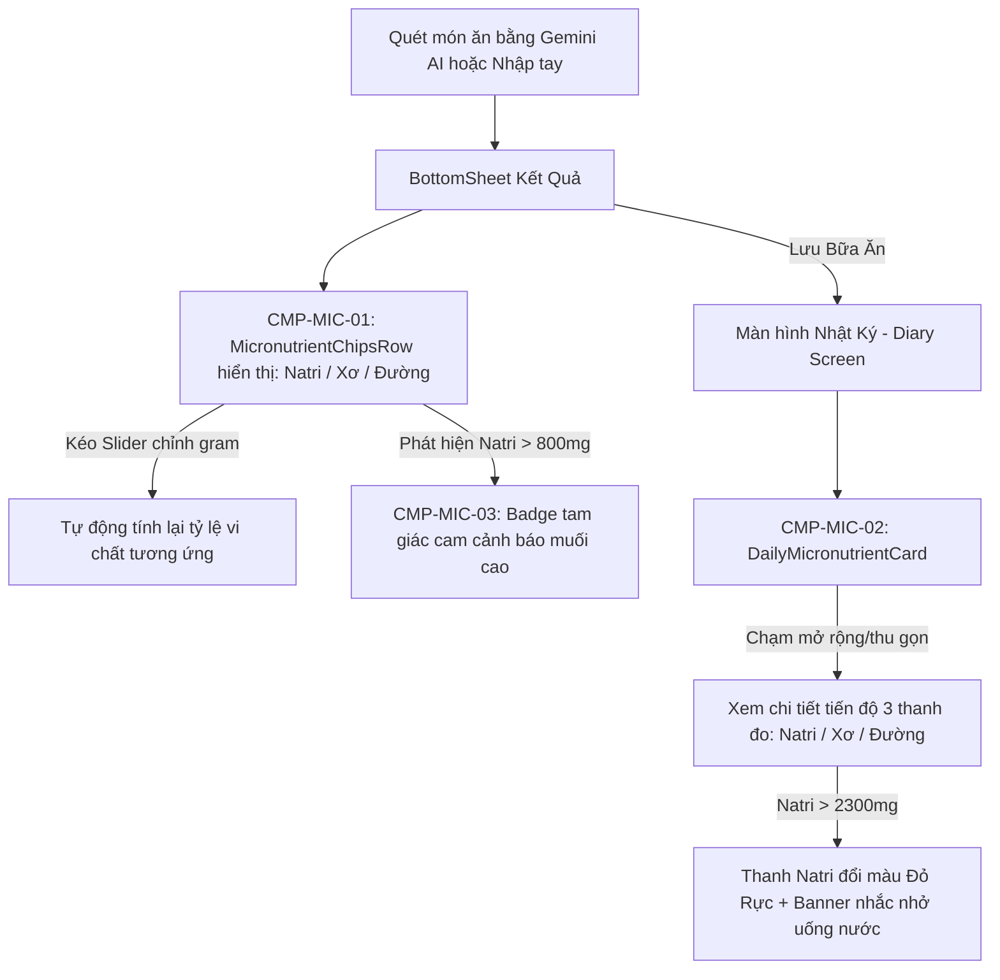

# Đặc Tả Thiết Kế Giao Diện (UI/UX Design Spec): Theo Dõi Vi Chất Dinh Dưỡng Nâng Cao (Micronutrients Tracking)

> **Mã tính năng**: `FEAT-08` (Micronutrient Tracking: Natri, Chất Xơ, Đường)  
> **Thuộc Cổng**: Gate 2 (Mobile UI/UX Design Gate)  
> **Sub-Agent Thiết kế**: `ui-ux-designer`  
> **Tài liệu tham chiếu**: [PRD FEAT-08](file:///Users/nguyenduytrang/flutter_project/AstroBite/docs/03-prd-features/08-micronutrients-tracking/prd-micronutrients.md), [User Stories FEAT-08](file:///Users/nguyenduytrang/flutter_project/AstroBite/docs/03-prd-features/08-micronutrients-tracking/user-stories.md), Design System ([`DESIGN.md`](file:///Users/nguyenduytrang/flutter_project/AstroBite/DESIGN.md))  
> **Trạng thái**: 🟢 **Đã Nghiệm Thu Gate 2 (BA & PO Signed Off)**  

---

## 1. Danh Sách Màn Hình & Sơ Đồ Điều Hướng (Navigation Flow)

### 1.1. Bảng Danh Mục Thành Phần UI Vi Chất
| Mã UI Component | Tên Thành Phần / Widget | Vị Trí Hiển Thị | Bối Cảnh & Mục Đích Sử Dụng |
| :---: | :--- | :--- | :--- |
| `CMP-MIC-01` | `MicronutrientChipsRow` (Hàng Chips Vi Chất) | Dưới MacroBar trong BottomSheet kết quả quét & Chi tiết món | Hiển thị 3 chỉ số vi chất: Natri (mg), Chất xơ (g), Đường (g) |
| `CMP-MIC-02` | `DailyMicronutrientCard` (Thẻ Vi Chất Mở Rộng) | Màn hình Nhật Ký (Diary Screen) | Hiển thị 3 thanh tiến độ theo dõi ngưỡng khuyến nghị cả ngày |
| `CMP-MIC-03` | `HighSodiumAlertBadge` (Huy hiệu cảnh báo muối) | Cạnh tên món ăn có Natri > 800mg | Cảnh báo trực quan cho người cần kiểm soát huyết áp/tim mạch |

### 1.2. Sơ Đồ Luồng Tương Tác Người Dùng (Mermaid Navigation Flow)

---

## 2. Blueprint Bố Cục & Thông Số Lưới 4pt (Component Layout Blueprints)

### 2.1. Cụm Chips Vi Chất `CMP-MIC-01: MicronutrientChipsRow`
- **Vị trí**: Nằm ngay dưới thanh MacroBar trong các thẻ món ăn hoặc trong BottomSheet kết quả.
- **Bố cục**: Hàng ngang gồm 3 Chips (Wrap hoặc Row with spacing `8pt`).
- **Quy cách mỗi Chip**:
  - Chiều cao: `28pt`, bo góc `8pt`, padding ngang `10pt`, padding dọc `4pt`.
  - Nền: `rgba(255, 255, 255, 0.05)` (bán trong suốt dịu mắt).
  - Viền: `1px solid rgba(255, 255, 255, 0.1)`.
  - **Chip 1 — Natri (Muối)**:
    - Icon: Hạt muối lấp lánh (`Icons.grain_rounded`), màu xanh Cyan `#00E5FF` (hoặc màu Cam `#FF9100` nếu vượt 800mg).
    - Text: `Muối: 450 mg` — Font Inter Medium `12pt`, màu `#FFFFFF`.
  - **Chip 2 — Chất xơ**:
    - Icon: Chiếc lá (`Icons.eco_rounded`), màu xanh ngọc bích `#00E676`.
    - Text: `Xơ: 3.5 g` — Font Inter Medium `12pt`, màu `#FFFFFF`.
  - **Chip 3 — Lượng đường**:
    - Icon: Viên đường / Giọt mật (`Icons.water_drop_rounded`), màu trắng bạc `#E0E0E0` (hoặc Cam nếu > 20g).
    - Text: `Đường: 2.0 g` — Font Inter Medium `12pt`, màu `#FFFFFF`.

### 2.2. Thẻ Vi Chất Trong Ngày `CMP-MIC-02: DailyMicronutrientCard`
- **Vị trí**: Trên màn hình Diary, nằm dưới thẻ tổng Calo & Macro chính.
- **Container**: `GlassCard`, padding `16pt`, bo góc `16pt`, nền `AppColors.surfaceContainer` (`#112240`).
- **Phần Header Thẻ**:
  - Tiêu đề: *"Vi Chất Dinh Dưỡng Hôm Nay"* — Font Inter Bold `16pt`, màu `#FFFFFF`.
  - Nút Mở Rộng / Thu Gọn (Expand/Collapse Icon): `24 × 24pt` trong vùng chạm `44 × 44pt`.
- **Phần Nội Dung (3 Thanh Đo Tiến Độ - Progress Bars)**:
  1. **Thanh Natri (Sodium Bar - Ngưỡng tối đa 2,300 mg)**:
     - Nhãn: `Natri: 1,450 / 2,300 mg` (Font Inter Medium `13pt`).
     - Thanh đo chiều cao `6pt`, bo góc `3pt`.
     - Quy tắc đổi màu:
       - `< 1,800 mg`: Màu Cyan `#00E5FF` (An toàn).
       - `1,800 - 2,300 mg`: Màu Cam Hổ Phách `#FF9100` (Cận ngưỡng).
       - `> 2,300 mg`: Màu Đỏ Cảnh Báo `#FF5252` (Vượt ngưỡng khuyến nghị).
  2. **Thanh Chất Xơ (Fiber Bar - Ngưỡng tối thiểu 25g Nữ / 38g Nam)**:
     - Nhãn: `Chất xơ: 18 / 25 g` (Font Inter Medium `13pt`).
     - Thanh đo màu Xanh Ngọc Bích `#00E676`. Khi đạt >= 25g, xuất hiện icon ngôi sao lấp lánh biểu thị đạt mục tiêu.
  3. **Thanh Đường (Sugar Bar - Ngưỡng tối đa 25g Nữ / 36g Nam)**:
     - Nhãn: `Đường: 22 / 36 g` (Font Inter Medium `13pt`).
     - Thanh đo màu xám sáng `#E0E0E0`, chuyển sang Cam `#FF9100` khi tiệm cận và Đỏ `#FF5252` khi vượt hạn mức WHO.

### 2.3. Huy Hiệu Cảnh Báo Món Ăn Mặn `CMP-MIC-03: HighSodiumAlertBadge`
- **Kích thước**: Chiều cao `20pt`, bo góc `4pt`, padding ngang `6pt`.
- **Nền**: `rgba(255, 145, 0, 0.15)`, viền `1px solid #FF9100`.
- **Icon**: Tam giác cảnh báo (`Icons.warning_amber_rounded`), màu Cam `#FF9100`, kích thước `12pt`.
- **Văn bản**: `Muối cao` — Font Inter Bold `10pt`, màu `#FFB74D`.
- **Hành vi khi chạm**: Hiển thị Tooltip nhẹ nhàng: *"Món ăn chứa hơn 800mg Natri (>1/3 hạn mức khuyến nghị cả ngày). Hãy chú ý uống đủ nước nhé!"*

---

## 3. Đặc Tả 5 Trạng Thái Giao Diện Bắt Buộc (The 5 Essential States)

| Trạng Thái | Mô Tả Hành Vi Giao Diện | Quy Chuẩn Trực Quan (Visual Specs) |
| :--- | :--- | :--- |
| **1. Default (Dữ liệu đầy đủ)** | Hiển thị 3 thanh vi chất với các con số và màu sắc chuẩn theo ngưỡng khoa học. | Render mượt mà 60 FPS, tương phản chuẩn Dark UI, không gây mỏi mắt. |
| **2. Loading (Đang nạp dữ liệu)** | Đang tải lịch sử các bữa ăn trong ngày từ cache/database. | 3 thanh Skeleton Shimmer thanh mảnh chu kỳ 1.5s, kích thước bằng đúng 3 progress bars thực tế. |
| **3. Empty (Chưa ăn gì trong ngày)** | Ngày mới chưa có bữa ăn nào được ghi nhận. | 3 thanh đo ở mức `0`, nhãn hiển thị `0 / 2300 mg`, màu xám mờ tinh tế. |
| **4. Error (Lỗi nạp dữ liệu)** | Lỗi truy vấn dữ liệu dinh dưỡng. | Hiển thị dòng chữ xám: *"Chưa thể tải dữ liệu vi chất. Chạm để thử lại."* |
| **5. Offline (Ngoại tuyến)** | Thiết bị ngắt kết nối mạng. | Thẻ vi chất tính toán tổng hợp hoàn toàn từ các bản ghi trong Local Cache, hiển thị chính xác 100% không bị ảnh hưởng bởi mạng. |

---

## 4. Bảng Ánh Xạ Token Celestial Dark UI (Design Token Mapping)

| Thành Phần Giao Diện | M3 Token / AppColors | Giá Trị Hex / RGB | Mục Đích Dinh Dưỡng & Ngữ Nghĩa |
| :--- | :--- | :--- | :--- |
| Nền thẻ Thống kê Vi chất | `AppColors.surfaceContainer` | `#112240` | Khối thẻ chính, bo góc 16px |
| Lớp phủ mờ nền thẻ | `AppColors.surfaceBlur` | `rgba(25, 42, 70, 0.6)` | Hiệu ứng kính mờ |
| Thanh đo Natri an toàn | Custom Celestial Cyan | `#00E5FF` | Natri trong hạn mức an toàn |
| Thanh đo Chất xơ đạt chuẩn | Custom Celestial Emerald | `#00E676` | Chất xơ đạt mục tiêu tiêu hóa |
| Thanh đo Đường bình thường | Custom Light Grey | `#E0E0E0` | Mức đường bình thường |
| Cảnh báo Tiệm cận ngưỡng | Custom Amber Alert | `#FF9100` | Cảnh báo tiệm cận hạn mức |
| Cảnh báo Vượt ngưỡng y khoa | Custom Red Alert | `#FF5252` | Vượt hạn mức tối đa của WHO |
| **Carbs (Đại lượng chính)** | `AppColors.primary` | `#1A73E8` | **Bất biến**: Không dùng cho vi chất |
| **Fat (Đại lượng chính)** | `AppColors.secondary` | `#FF69B4` | **Bất biến**: Không dùng cho vi chất |
| **Protein (Đại lượng chính)**| `AppColors.tertiary` | `#FFD700` | **Bất biến**: Không dùng cho vi chất |

---

## 5. Handoff Specs & Kỷ Luật Ponytail Cho Dev FE

1. **Thành phần tái sử dụng bắt buộc**:
   - Sử dụng `GlassCard` làm container cho thẻ `DailyMicronutrientCard`.
   - Các thanh đo sử dụng `ClipRRect` bo tròn kết hợp `LinearProgressIndicator` hoặc Container có animation nhẹ nhàng.
2. **Kỷ luật Ponytail**:
   - Không đưa thêm package đồ thị phức tạp vào để vẽ 3 thanh vi chất; chỉ dùng Widget Flutter gốc (`LinearProgressIndicator` hoặc `Row`/`Container`).
   - Tự động fallback về `0.0` nếu các trường `sodium_mg`, `fiber_g`, `sugar_g` bị thiếu trong các bản ghi cũ của phiên bản v1.0.0.
