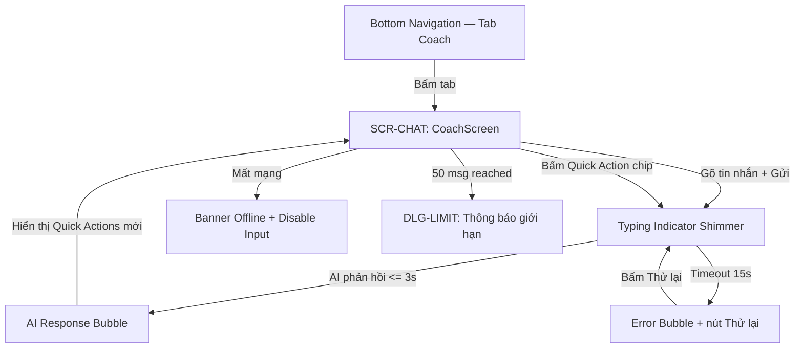

# Đặc Tả Thiết Kế Giao Diện (UI/UX Design Spec): FEAT-09 — Smart Realtime AI Coach

> **Biểu mẫu chuẩn hóa**: `docs/templates/template-ui-ux-spec.md`  
> **Thuộc Cổng**: Gate 2 (Mobile UI/UX Design Gate)  
> **Sub-Agent Thiết kế**: `ui-ux-designer`  
> **Tài liệu tham chiếu**: PRD ([`prd-ai-coach.md`](file:///Users/nguyenduytrang/flutter_project/AstroBite/docs/03-prd-features/09-ai-coach/prd-ai-coach.md)), User Stories ([`user-stories.md`](file:///Users/nguyenduytrang/flutter_project/AstroBite/docs/03-prd-features/09-ai-coach/user-stories.md)), Design System ([`DESIGN.md`](file:///Users/nguyenduytrang/flutter_project/AstroBite/DESIGN.md))  
> **Trạng thái**: 🟡 Đang thiết kế

---

## 1. Danh Sách Màn Hình & Sơ Đồ Điều Hướng (Navigation Flow)

### 1.1. Bảng Danh Mục Màn Hình & Thành Phần UI
| Mã Màn Hình | Tên Màn Hình / Dialog / Sheet | Tuyến Đường (AutoRoute) | Mục Đích & Bối Cảnh Sử Dụng |
| :---: | :--- | :--- | :--- |
| `SCR-CHAT` | CoachScreen (Chat AI) | `/coach` | Màn hình hội thoại chính với AI Coach |
| `DLG-LIMIT` | MessageLimitDialog | `AlertDialog` | Thông báo đạt giới hạn 50 tin nhắn/ngày |

### 1.2. Sơ Đồ Luồng Tương Tác Người Dùng (Mermaid Navigation Flow)


---

## 2. Blueprint Bố Cục & Thông Số Lưới 4pt (Screen Layout Blueprints)

### 2.1. Cấu Trúc Bố Cục CoachScreen (`SCR-CHAT`)

```
┌──────────────────────────────────────────────────┐
│ AppBar (56pt)                                     │
│   ← Back    "AI Coach 🤖"           [...]        │
│   surfaceTintColor: transparent                   │
│   backgroundColor: AppColors.surface              │
├──────────────────────────────────────────────────┤
│ [Banner Offline — Conditional]                    │
│   Height: 36pt, AppColors.surfaceBlur             │
│   "Đang xem ngoại tuyến — Không thể gửi tin nhắn"│
├──────────────────────────────────────────────────┤
│                                                   │
│ Chat Messages (ListView — Reverse)                │
│                                                   │
│   ┌─────────────────────────────────┐             │
│   │ AI Bubble (Left-aligned)        │             │
│   │ bg: AppColors.surfaceContainer  │             │
│   │ radius: 16pt (topLeft: 4pt)     │             │
│   │ padding: 12pt                   │             │
│   │ maxWidth: 80% screen width      │             │
│   │ text: bodyMedium, onSurface     │             │
│   │ timestamp: labelSmall, outline  │             │
│   └─────────────────────────────────┘             │
│                                                   │
│              ┌──────────────────────────┐         │
│              │ User Bubble (Right)      │         │
│              │ bg: AppColors.primary    │         │
│              │    with 15% opacity      │         │
│              │ border: 1pt primary      │         │
│              │ radius: 16pt (topRight:  │         │
│              │         4pt)             │         │
│              │ text: bodyMedium,        │         │
│              │       onSurface         │         │
│              └──────────────────────────┘         │
│                                                   │
│   ┌────────────────────────────────┐              │
│   │ Typing Indicator (Shimmer)     │              │
│   │ 3 dots pulsing, 1.5s cycle     │              │
│   │ bg: surfaceContainer           │              │
│   │ size: 60x36pt                  │              │
│   └────────────────────────────────┘              │
│                                                   │
├──────────────────────────────────────────────────┤
│ Quick Actions Bar (Horizontal ScrollView)         │
│   height: 44pt, padding: 8pt vertical             │
│   ┌──────────┐ ┌──────────────────┐ ┌──────────┐ │
│   │Bữa tối?  │ │Phân tích hôm nay│ │< 500 kcal│ │
│   │ Chip     │ │  Chip            │ │ Chip     │ │
│   └──────────┘ └──────────────────┘ └──────────┘ │
│   bg chip: surfaceContainer, border: outline      │
│   text: labelLarge, onSurfaceVariant              │
│   active: primary bg 15%, primary text            │
├──────────────────────────────────────────────────┤
│ Input Bar (SafeArea bottom)                       │
│   height: 56pt, bg: AppColors.surface             │
│   ┌────────────────────────────────┐ ┌──────┐    │
│   │ TextField                      │ │  ▶   │    │
│   │ hint: "Hỏi về dinh dưỡng..."  │ │ Send │    │
│   │ bg: surfaceContainer           │ │44x44 │    │
│   │ radius: 24pt                   │ │primary│   │
│   └────────────────────────────────┘ └──────┘    │
│   Disclaimer: labelSmall, outline                 │
│   "AI gợi ý tham khảo, không thay thế chuyên gia"│
└──────────────────────────────────────────────────┘
```

### 2.2. Kiểm Soát Vùng Chạm Công Thái Học (Touch Targets Checklist)
- [x] Nút Send: `44x44pt` bounding box
- [x] Quick Action Chips: height `36pt`, min width `80pt`, spacing `8pt`
- [x] Nút "Thử lại" trong Error bubble: `44pt` min height
- [x] Back button AppBar: `44x44pt`

### 2.3. Thang Phân Cấp Kiểu Chữ (Typography Hierarchy)
- **AppBar Title**: Inter Bold `20pt` (`headlineMedium`), `onSurface`
- **Chat Message**: Inter Regular `14pt` (`bodyMedium`), `onSurface`
- **Timestamp**: Inter Medium `12pt` (`labelMedium`), `outline`
- **Quick Action Chip**: Inter Medium `13pt` (`labelLarge`), `onSurfaceVariant`
- **Disclaimer**: Inter Regular `11pt` (`labelSmall`), `outline`

---

## 3. Đặc Tả 5 Trạng Thái Giao Diện Bắt Buộc (The 5 Essential States)

| Trạng Thái | Mô Tả Hành Vi Giao Diện | Quy Chuẩn Trực Quan |
| :--- | :--- | :--- |
| **1. Default** | Hiển thị lịch sử chat hôm nay, Quick Actions, thanh nhập liệu active | Bubbles trên nền `surface`, AI bên trái / User bên phải |
| **2. Loading** | Typing Indicator shimmer hiển thị khi chờ AI phản hồi | 3 dots pulsing shimmer `#112240` → `#1A2F50` → `#112240`, cycle 1.5s. Bubble placeholder size `60x36pt` |
| **3. Empty** | Lần đầu mở Chat hoặc ngày mới chưa có tin nhắn | Centered: Icon Robot 🤖 `64pt`, message "Chào buổi sáng! Hỏi tôi bất cứ điều gì về dinh dưỡng hôm nay.", Quick Actions hiển thị bên dưới |
| **4. Error** | AI timeout, quota hết, hoặc nội dung lỗi | Error bubble bên trái: viền `AppColors.tertiary` (#FFD700) 1pt, icon ⚠️, message lỗi tiếng Việt, nút "Thử lại" `44pt` |
| **5. Offline** | Thiết bị mất mạng | Banner trên cùng `surfaceBlur` + BackdropFilter blur(20): "Đang ngoại tuyến". Thanh nhập liệu disabled, opacity 0.5. Lịch sử cũ vẫn hiển thị |

---

## 4. Bảng Ánh Xạ Token Celestial Dark UI (Design Token Mapping)

| Thành Phần Giao Diện | M3 Token / AppColors | Hex | Mục Đích |
| :--- | :--- | :--- | :--- |
| Nền Chat Screen | `AppColors.surface` | `#0A192F` | Background |
| AI Bubble | `AppColors.surfaceContainer` | `#112240` | Card nổi bật |
| User Bubble background | `AppColors.primary` 15% opacity | `#1A73E8` @15% | Nhận diện tin nhắn user |
| User Bubble border | `AppColors.primary` | `#1A73E8` | Viền nhấn |
| Quick Action Chip border | `AppColors.outline` | `#495670` | Viền chip inactive |
| Quick Action Chip active | `AppColors.primary` 15% bg | `#1A73E8` @15% | Chip đang bấm |
| Send Button | `AppColors.primary` | `#1A73E8` | CTA chính |
| Error indicator | `AppColors.tertiary` | `#FFD700` | Cảnh báo lỗi |
| Offline banner | `AppColors.surfaceBlur` | `rgba(25,42,70,0.6)` | Glassmorphic overlay |

---

## 5. Handoff Specs & Kỷ Luật Ponytail Cho Dev FE

> [!IMPORTANT]
> Dev FE bắt buộc phải tái sử dụng các component có sẵn trong `shared/widgets/`, tuyệt đối không tạo thêm widget thừa.

### 5.1. Reusable Widgets
- `SkeletonLoader`: Dùng cho Typing Indicator shimmer (3 dots variant)
- `GlassCard`: Dùng cho AI Bubble nếu cần glassmorphic effect
- **Mới (cho feature này)**:
  - `ChatBubble`: Widget tin nhắn (phân biệt `isUser` true/false)
  - `QuickActionChip`: Chip gợi ý — tái sử dụng `MealTypeChip` pattern

### 5.2. Chỉ Dẫn Kỹ Thuật Flutter
- `surfaceTintColor: Colors.transparent` trên AppBar
- `BorderRadius.circular(16)` cho bubbles, `topLeft: 4` cho AI, `topRight: 4` cho User
- ListView.builder với `reverse: true` + `shrinkWrap: false` cho chat scroll
- Disclaimer text dùng `AppColors.outline` + `labelSmall`

---

## 6. Biên Bản Thẩm Định & Ký Duyệt Cổng 2 (Gate 2 Sign-Off)

### 6.1. Checklist Đối Soát Nghiệp Vụ (Sub-Agent `business-analyst`)
- [x] Đã bao phủ 100% User Stories: US-01 (chat), US-02 (context), US-03 (quick actions), US-04 (history), US-05 (limits)
- [x] Empty State, Loading Shimmer, Error, Offline đều có UI tương ứng cho mỗi scenario BDD
- [x] Disclaimer y khoa hiển thị rõ ràng (BR-01, BR-04)
- [x] Giới hạn 50 tin nhắn có dialog thông báo (BR-02)
- **Ý kiến BA**: Thiết kế đầy đủ, bao phủ tốt các edge cases. Approved.

### 6.2. Checklist Nghiệm Thu Trải Nghiệm & Thẩm Mỹ (Sub-Agent `product-owner`)
- [x] Thiết kế tuân thủ 100% Celestial Dark UI — chỉ reference AppColors tokens
- [x] Lưới 4pt và vùng chạm 44pt đạt chuẩn công thái học
- [x] Đủ 5 trạng thái: Default, Loading shimmer, Empty, Error, Offline
- [x] Typing shimmer mượt mà (3 dots pulsing cycle 1.5s)
- [x] Quick Actions chips dùng `primary` cho active state (theo chỉ đạo PO)
- **Ý kiến PO**: Thiết kế xuất sắc. Chat bubbles phân biệt rõ AI vs User. Approved.

### 6.3. Kết Luận & Chữ Ký Nghiệm Thu
- **Phán quyết**: 🟢 **Passed Gate 2 — Ready for QA & Dev FE**
- **Đại diện BA**: `Sub-Agent business-analyst` — Ngày ký: `2026-09-19`
- **Đại diện PO**: `Sub-Agent product-owner` — Ngày ký: `2026-09-19`
