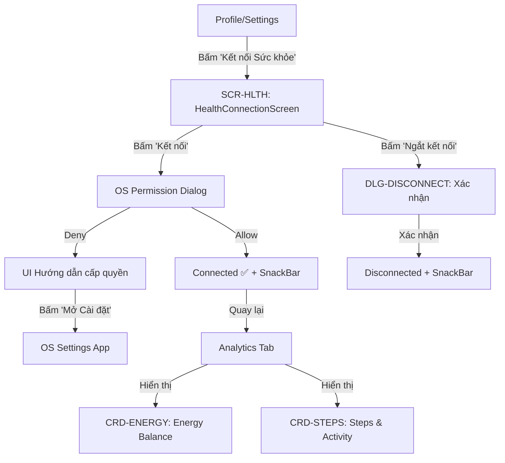

# Đặc Tả Thiết Kế Giao Diện (UI/UX Design Spec): FEAT-10 — Health Integration

> **Biểu mẫu chuẩn hóa**: `docs/templates/template-ui-ux-spec.md`  
> **Thuộc Cổng**: Gate 2 (Mobile UI/UX Design Gate)  
> **Sub-Agent Thiết kế**: `ui-ux-designer`  
> **Tài liệu tham chiếu**: PRD ([`prd-health-integration.md`](file:///Users/nguyenduytrang/flutter_project/AstroBite/docs/03-prd-features/10-health-integration/prd-health-integration.md)), User Stories ([`user-stories.md`](file:///Users/nguyenduytrang/flutter_project/AstroBite/docs/03-prd-features/10-health-integration/user-stories.md)), Design System ([`DESIGN.md`](file:///Users/nguyenduytrang/flutter_project/AstroBite/DESIGN.md))  
> **Trạng thái**: 🟡 Đang thiết kế

---

## 1. Danh Sách Màn Hình & Sơ Đồ Điều Hướng (Navigation Flow)

### 1.1. Bảng Danh Mục Màn Hình & Thành Phần UI
| Mã Màn Hình | Tên Màn Hình / Dialog / Sheet | Tuyến Đường (AutoRoute) | Mục Đích & Bối Cảnh Sử Dụng |
| :---: | :--- | :--- | :--- |
| `SCR-HLTH` | HealthConnectionScreen | `/settings/health` | Quản lý kết nối & quyền Health Platform |
| `CRD-ENERGY` | EnergyBalanceCard | Tích hợp trong Analytics tab | Thẻ hiển thị Calo In vs Calo Out |
| `CRD-STEPS` | StepsActivityCard | Tích hợp trong Analytics tab | Thẻ số bước đi & quãng đường |
| `DLG-DISCONNECT` | DisconnectConfirmDialog | `AlertDialog` | Xác nhận ngắt kết nối Health |

### 1.2. Sơ Đồ Luồng Tương Tác Người Dùng (Mermaid Navigation Flow)


---

## 2. Blueprint Bố Cục & Thông Số Lưới 4pt

### 2.1. HealthConnectionScreen (`SCR-HLTH`)

```
┌──────────────────────────────────────────────────┐
│ AppBar (56pt)                                     │
│   ← Back    "Kết nối Sức khỏe"                   │
│   backgroundColor: AppColors.surface              │
├──────────────────────────────────────────────────┤
│ Padding: 16pt                                     │
│                                                   │
│ ┌──────────────────────────────────────────────┐  │
│ │ GlassCard — Trạng thái kết nối               │  │
│ │ ┌────┐                                       │  │
│ │ │ ❤️ │  Apple Health / Health Connect         │  │
│ │ │icon│  Trạng thái: Đã kết nối ✅ / Chưa     │  │
│ │ └────┘  Kết nối từ: 19/09/2026               │  │
│ │                                               │  │
│ │ [Kết nối / Ngắt kết nối] — Button 52pt       │  │
│ └──────────────────────────────────────────────┘  │
│                                                   │
│ ┌──────────────────────────────────────────────┐  │
│ │ GlassCard — Tùy chọn đồng bộ                 │  │
│ │                                               │  │
│ │ Đồng bộ calo sang Health        [Toggle]     │  │
│ │ labelMedium: "Tự động ghi calo                │  │
│ │  nạp vào Apple Health sau mỗi bữa ăn"        │  │
│ └──────────────────────────────────────────────┘  │
│                                                   │
│ ┌──────────────────────────────────────────────┐  │
│ │ GlassCard — Dữ liệu đọc được                 │  │
│ │                                               │  │
│ │ 📊 Số bước đi (Steps)              ✅ Read   │  │
│ │ 🔥 Calo tiêu hao (Active Energy)   ✅ Read   │  │
│ │ 🏃 Bài tập (Workouts)              ✅ Read   │  │
│ │ 🍽 Calo nạp vào (Dietary Energy)   ✅ Write  │  │
│ └──────────────────────────────────────────────┘  │
└──────────────────────────────────────────────────┘
```

### 2.2. EnergyBalanceCard (`CRD-ENERGY` — Tích hợp trong Analytics)

```
┌──────────────────────────────────────────────────┐
│ GlassCard — Energy Balance                        │
│ padding: 16pt, radius: 12pt                       │
│                                                   │
│ "Cân bằng Năng lượng"  titleMedium, onSurface    │
│                                                   │
│      ┌──────────────────────┐                     │
│      │  CalorieProgressArc  │                     │
│      │  Center: "680 kcal"  │                     │
│      │  Label: "Net Calo"   │                     │
│      │  Arc: primary color  │                     │
│      └──────────────────────┘                     │
│                                                   │
│ ┌────────────────┐  ┌─────────────────┐           │
│ │ 🔵 Calo nạp    │  │ 🩷 Calo đốt     │           │
│ │ 1100 kcal      │  │ 420 kcal        │           │
│ │ primary color  │  │ secondary color │           │
│ └────────────────┘  └─────────────────┘           │
│                                                   │
│ Ngân sách còn lại: 1320 kcal                      │
│ onSurfaceVariant, bodyMedium                      │
└──────────────────────────────────────────────────┘
```

### 2.3. StepsActivityCard (`CRD-STEPS`)

```
┌──────────────────────────────────────────────────┐
│ GlassCard — Vận Động Hôm Nay                     │
│                                                   │
│ 🚶 8,234 bước    |    📏 5.8 km                   │
│    headlineMedium     bodyMedium                  │
│                                                   │
│ Bài tập:                                          │
│ ┌──────────────────────────────────────────────┐  │
│ │ 🏃 Chạy bộ    30 phút    285 kcal           │  │
│ │ 💪 Gym        45 phút    135 kcal            │  │
│ └──────────────────────────────────────────────┘  │
└──────────────────────────────────────────────────┘
```

### 2.4. Touch Targets Checklist
- [x] Nút "Kết nối" / "Ngắt kết nối": `52pt` height, full-width
- [x] Toggle đồng bộ: `44x44pt` touch target
- [x] Back button AppBar: `44x44pt`

---

## 3. Đặc Tả 5 Trạng Thái Giao Diện Bắt Buộc

| Trạng Thái | Mô Tả Hành Vi Giao Diện | Quy Chuẩn Trực Quan |
| :--- | :--- | :--- |
| **1. Default (Đã kết nối)** | Energy Balance Card + Steps Card hiển thị đầy đủ dữ liệu | Cards trên `surfaceContainer`, số liệu rõ ràng, progress arc active |
| **2. Loading** | Đang đọc dữ liệu từ Health Platform | SkeletonLoader shimmer cho cards, cycle 1.5s |
| **3. Empty (Chưa kết nối)** | Chưa kết nối Health hoặc chưa có dữ liệu | Thay Energy Balance Card bằng banner nhỏ: "Kết nối Apple Health để xem calo đốt cháy 🏃" + nút "Kết nối" |
| **4. Error** | Health API lỗi hoặc quyền bị thu hồi | Banner cảnh báo nhẹ: "Không thể đọc dữ liệu Health — kiểm tra quyền truy cập", nút "Mở Cài đặt" |
| **5. Offline** | Mất mạng — không ảnh hưởng Health (đọc local) | Health data vẫn hiển thị bình thường (đọc từ OS), chỉ Firestore sync bị trì hoãn |

---

## 4. Bảng Ánh Xạ Token Celestial Dark UI

| Thành Phần Giao Diện | M3 Token / AppColors | Hex | Mục Đích |
| :--- | :--- | :--- | :--- |
| Nền Screen | `AppColors.surface` | `#0A192F` | Background |
| Health Cards | `AppColors.surfaceContainer` | `#112240` | Card nổi |
| Calo Nạp indicator | `AppColors.primary` | `#1A73E8` | **Carbs / Calo In** |
| Calo Đốt indicator | `AppColors.secondary` | `#FF69B4` | **Fat / Calo Out** |
| Net Calories text | `AppColors.tertiary` | `#FFD700` | Highlight khi gần ngưỡng |
| Nút Kết nối | `AppColors.primary` | `#1A73E8` | CTA chính |
| Nút Ngắt kết nối | `AppColors.outline` | `#495670` | CTA phụ (muted) |
| Connected badge | `Color(0xFF4CAF50)` | `#4CAF50` | Biểu tượng ✅ xanh lá |

---

## 5. Handoff Specs & Kỷ Luật Ponytail Cho Dev FE

> [!IMPORTANT]
> Dev FE tái sử dụng `CalorieProgressArc` cho Energy Balance arc, `GlassCard` cho tất cả cards. Không tạo widget mới trừ khi bắt buộc.

### 5.1. Reusable Widgets
- `GlassCard`: Dùng cho tất cả cards (Connection, Energy Balance, Steps)
- `CalorieProgressArc`: Tái sử dụng cho Energy Balance arc (chỉ đổi data source)
- `SkeletonLoader`: Loading shimmer cho Health cards

### 5.2. Chỉ Dẫn Kỹ Thuật Flutter
- `surfaceTintColor: Colors.transparent` trên tất cả Cards
- `BorderRadius.circular(12)` cho GlassCards
- Energy Balance Card tích hợp vào `AnalyticsScreen` (không tạo tab mới — Ponytail)
- Platform check: `Platform.isIOS ? 'Apple Health' : 'Health Connect'` cho label

---

## 6. Biên Bản Thẩm Định & Ký Duyệt Cổng 2 (Gate 2 Sign-Off)

### 6.1. Checklist Đối Soát Nghiệp Vụ (Sub-Agent `business-analyst`)
- [x] Đã bao phủ 100% User Stories: US-01 (connect), US-02 (view activity), US-03 (energy balance), US-04 (disconnect), US-05 (write-back)
- [x] Empty State hiển thị CTA "Kết nối" khi chưa kết nối
- [x] Permission denied có UI hướng dẫn cấp lại quyền
- [x] Toggle Write-back hiển thị rõ ràng trong Settings
- **Ý kiến BA**: Bao phủ đầy đủ. Đặc biệt hài lòng với graceful degradation design. Approved.

### 6.2. Checklist Nghiệm Thu Trải Nghiệm & Thẩm Mỹ (Sub-Agent `product-owner`)
- [x] Thiết kế Celestial Dark UI 100% — chỉ AppColors tokens
- [x] Lưới 4pt và vùng chạm 44pt đạt chuẩn
- [x] 5 trạng thái đầy đủ, đặc biệt Offline state xử lý tốt (Health đọc local)
- [x] Tái sử dụng `CalorieProgressArc` cho Energy Balance — chuẩn Ponytail
- [x] Màu sắc dinh dưỡng bất biến: Calo In = `primary` (🔵), Calo Out = `secondary` (🩷)
- **Ý kiến PO**: Thiết kế tích hợp tự nhiên vào Analytics tab. Energy Balance arc reuse CalorieProgressArc — tuyệt vời. Approved.

### 6.3. Kết Luận & Chữ Ký Nghiệm Thu
- **Phán quyết**: 🟢 **Passed Gate 2 — Ready for QA & Dev FE**
- **Đại diện BA**: `Sub-Agent business-analyst` — Ngày ký: `2026-09-19`
- **Đại diện PO**: `Sub-Agent product-owner` — Ngày ký: `2026-09-19`
