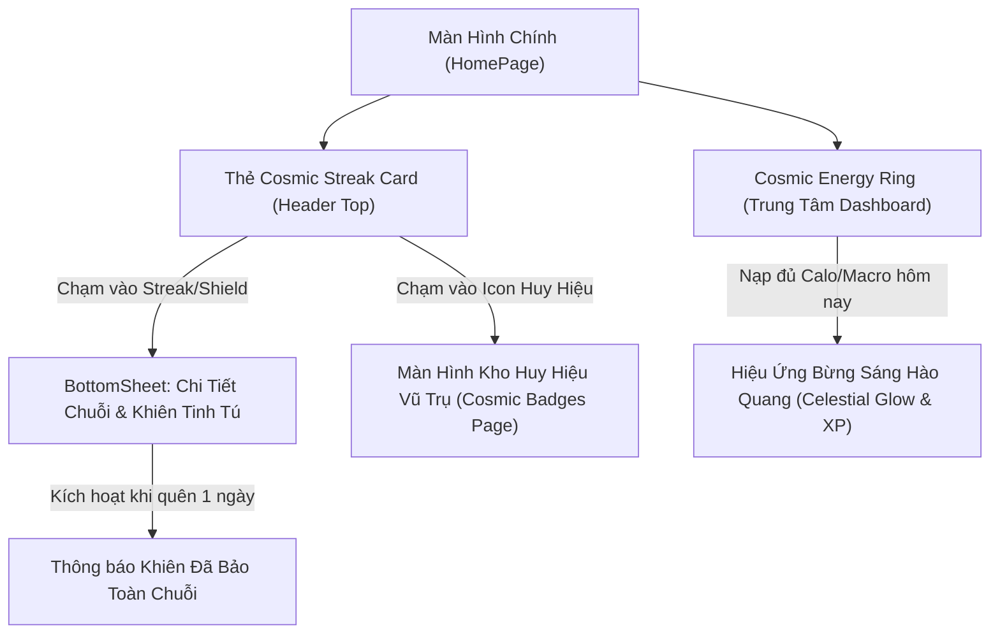

# UI/UX Design Spec: Vòng Năng Lượng Vũ Trụ & Huy Hiệu Tiểu Vũ Trụ (Cosmic Gamification UI)

- **Mã tính năng**: `FEAT-11` (Gate 2 Design Blueprint)
- **Mã Epic liên kết**: `EPIC-13` (Gamification & Cosmic Streak Engine)
- **Bộ phận phụ trách**: Sub-Agent UI/UX Designer (`ui-ux-designer`) — *"The Celestial Aesthetic Purist"*
- **Trạng thái**: 🟡 **Ready for Gate 2 Sign-Off**
- **Tham chiếu PRD**: `docs/03-prd-features/11-gamification-streak/prd-gamification-streak.md` (Gate 1)
- **Hệ quy chiếu thiết kế**: `DESIGN.md` & `lib/core/theme/app_colors.dart`

---

## 1. Sơ Đồ Điều Hướng & Trải Nghiệm Người Dùng (Mermaid Flow)



---

## 2. Blueprint Bố Cục Giao Diện Lưới 4pt (Screen Layout Blueprint)

### 2.1. Thẻ Cosmic Streak & Shield (Gắn tại Header HomePage)
- **Vị trí**: Nằm ngang hàng với Lời chào và Avatar ở đầu `HomePage`.
- **Kích thước**: Chiều cao `40pt`, padding ngang `12pt`, bo góc `20pt` (Pill Shape).
- **Màu nền**: `AppColors.surfaceContainer` (`#112240`), viền `0.8pt` với `AppColors.border` hoặc ánh vàng ánh sao `AppColors.tertiary` khi có chuỗi cao.
- **Thành phần**:
  1. **Icon Ngọn Lửa Vũ Trụ / Tinh Tú (`Icons.local_fire_department_rounded`)**: Màu `AppColors.tertiary` (`#FFD700`).
  2. **Số Ngày Chuỗi**: Typography `HeadlineSmall`, `FontWeight.w700`, màu trắng tuyết `#FFFFFF`.
  3. **Vách ngăn mỏng**: `1pt` x `16pt` màu `AppColors.border`.
  4. **Icon Khiên Tinh Tú (`Icons.shield_moon_rounded`)**: Kèm số lượng chấm nhỏ (1..2 dots) biểu thị số khiên sẵn có.

### 2.2. Vòng Năng Lượng Vũ Trụ (Cosmic Energy Ring Component)
- **Kích thước**: `220x220pt` căn giữa Dashboard.
- **Cấu trúc vòng đa lớp**:
  - **Lớp ngoài cùng (Background Track)**: Vòng tròn bán kính `96pt`, độ dày `12pt`, màu `#1A2D4C` (Dark Cosmic Track).
  - **Lớp tiến độ Calo (Active Calorie Arc)**: Độ dày `12pt`, bo tròn 2 đầu (Round Cap), gradient từ `#1A73E8` (Carbs Blue) sang `#FF69B4` (Fat Pink) và kết thúc ở `#FFD700` (Protein Gold) khi đầy.
  - **Lõi Tiểu Vũ Trụ (Cosmic Core)**: Vòng tròn tâm đường kính `150pt`, hiệu ứng đổ bóng mờ `BoxShadow(color: Color(0x331A73E8), blurRadius: 24)`.
  - **Nội dung bên trong Lõi**:
    - Dòng 1: *"CÒN LẠI"* (Caption 10pt, `AppColors.onSurfaceVariant`).
    - Dòng 2: Số calo còn lại (Ví dụ: `650`, Headline 34pt, `FontWeight.bold`, `#FFFFFF`).
    - Dòng 3: *"KCAL TIỂU VŨ TRỤ"* (8pt, viền glow nhẹ).
    - Dòng 4: 3 chấm tròn nhỏ mang 3 màu chuẩn dinh dưỡng đại diện cho Carbs, Fat, Protein.

### 2.3. Màn Hình Huy Hiệu Thành Tích (Cosmic Badges Sheet)
- **Lưới hiển thị**: 2 cột (Grid 2 columns), khoảng cách `16pt`.
- **Thẻ huy hiệu (Badge Card)**:
  - Chiều cao: `140pt`.
  - Nền: `AppColors.surfaceContainer` (`#112240`).
  - Huy hiệu chưa mở khóa: Độ mờ `0.35` (Disabled Opacity), biểu tượng khóa xám.
  - Huy hiệu đã mở khóa: Hiệu ứng viền phát sáng Celestial Glow `2pt`, hiệu ứng sao băng lấp lánh quanh viền.

---

## 3. Quy Chuẩn 5 Trạng Thái Giao Diện Bắt Buộc (The 5 Strict UI States)

| Trạng Thái | Mô Tả Trải Nghiệm Giao Diện | Màu Sắc / Animation Token |
|:---|:---|:---|
| **1. Default State** | Hiển thị chuỗi ngày hiện tại, vòng năng lượng phản ánh chính xác % calo nạp vào, số khiên còn lại. | Nền `#0A192F`, viền `#1E3A5F`, icon vàng `#FFD700`. |
| **2. Shimmer / Loading** | Khung tròn `220x220pt` và thanh pill `40pt` hiển thị lớp gradient chuyển động mượt mà từ `#112240` sang `#1A2D4C`. | Thời gian chu kỳ shimmer: `1200ms`. |
| **3. Empty State (Chuỗi = 0)** | Người dùng mới chưa có chuỗi: Hiển thị icon hạt giống vũ trụ kèm thông điệp *"Ghi nhận món ăn đầu tiên để thắp sáng tiểu vũ trụ!"*. | Nút CTA `[+ Quét Món Ăn Ngay]` nổi bật. |
| **4. Error State** | Không đọc được dữ liệu Streak từ Firestore: Hiển thị fallback từ bộ nhớ đệm cục bộ (Local Cache) và icon chấm vàng cảnh báo nhỏ góc thẻ. | Không bao giờ chặn màn hình chính bằng dialog lỗi đỏ. |
| **5. Offline State** | Khi mất kết nối internet: Vẫn tự động tính chuỗi cục bộ bình thường; hiển thị icon đám mây gạch chéo nhỏ thông báo *"Chuỗi sẽ đồng bộ lên mây khi có mạng"*. | Giữ nguyên 100% khả năng tương tác. |

---

## 4. Bảng Ánh Xạ Design Tokens Chuẩn Celestial

```dart
// Strict Nutrient Color Semantics
const Color kCarbsIndicator = AppColors.primary;        // #1A73E8 (Blue)
const Color kFatIndicator = AppColors.secondary;        // #FF69B4 (Pink)
const Color kProteinIndicator = AppColors.tertiary;     // #FFD700 (Gold)

// Surfaces & Radii
const Color kCosmicSurface = AppColors.surface;         // #0A192F
const Color kCardSurface = AppColors.surfaceContainer;  // #112240
const double kCornerRadiusLg = AppValues.radiusXLarge;  // 24.0
const double kSpacingGrid = AppValues.paddingMedium;    // 16.0 (4pt aligned)
```

---

## 5. Ký Duyệt Cổng 2 (Gate 2 Sign-Off)

- **Thiết kế bởi**: Sub-Agent UI/UX Designer (`ui-ux-designer`) — **APPROVED**
- **Thẩm định quy chuẩn**: Tuân thủ 100% lưới 4pt, bảo toàn màu dinh dưỡng bất biến, đủ 5 trạng thái giao diện. Sẵn sàng bàn giao cho Sub-Agent QA Tester (Gate 3) và Dev FE (Gate 4).
