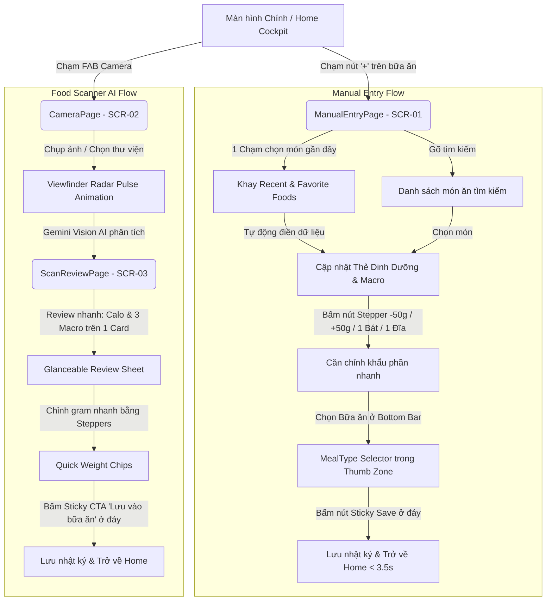

# Hồ Sơ Đặc Tả Thiết Kế Giao Diện (Gate 2 UI/UX Design Spec)
## Bộ Đôi Ghi Chép Dinh Dưỡng: Zero-Friction Ergonomic Logging

- **Mã tính năng**: `FEAT-14`
- **Mã Epic liên kết**: `EPIC-16` (Zero-Friction Ergonomic Food Logging: Scanner & Manual Entry)
- **Bộ phận phụ trách**: Sub-Agent Mobile UI/UX Designer — *"The Celestial Aesthetic Purist"*
- **Trạng thái**: 🟡 **Pending BA & PO Gate 2 Review**
- **Mục tiêu phiên bản**: `v1.6.0` (Sprint 07)
- **Tham chiếu PRD**: `docs/03-prd-features/14-zero-friction-logging/prd-zero-friction-logging.md` (Gate 1 Approved)

---

## 🧭 1. Sơ Đồ Điều Hướng Công Thái Học (Mermaid Navigation Flow)



---

## 📐 2. Bản Vẽ Bố Cục Chi Tiết Theo Lưới 4pt (Screen Layout Blueprint)

### 2.1. Màn Hình Nhập Tay (ManualEntryPage — SCR-01)

```
┌─────────────────────────────────────────────────────────────┐  0pt (Top)
│ [ < Trở về ]          Ghi chép món ăn        [ + Tự tạo món ]│  AppBar (h: 56pt)
├─────────────────────────────────────────────────────────────┤
│ 🔍 [ Tìm kiếm món ăn Việt Nam...                       ]    │  Search Bar (h: 48pt)
├─────────────────────────────────────────────────────────────┤
│ 🕒 GẦN ĐÂY: [🍽️ Phở bò 450k] [🍽️ Cơm tấm 620k] [🍽️ Ức gà 165k] │  Recent Tray (h: 44pt)
├─────────────────────────────────────────────────────────────┤  (Cuộn ngang, 1 chạm)
│                                                             │
│  ╔═══════════════════════════════════════════════════════╗  │  NUTRITION CARD
│  ║ 🍗 Ức gà luộc                           [ 165 kcal ]  ║  │  (GlassCard nền #112240)
│  ║                                                       ║  │  Bo góc: 16px
│  ║     🔵 Tinh bột        🟡 Chất đạm        🩷 Chất béo    ║  │  Padding: 16pt
│  ║        0.0g              31.0g              3.6g      ║  │
│  ║     (#1A73E8)          (#FFD700)          (#FF69B4)   ║  │
│  ║ ───────────────────────────────────────────────────── ║  │
│  ║  Khẩu phần nhanh (Steppers):                          ║  │  QUICK STEPPERS
│  ║  [ -50g ]  [ +50g ]  [ 1 Chén ~150g ]  [ 1 Đĩa ~300g ]║  │  Touch Target 44pt
│  ║ ───────────────────────────────────────────────────── ║  │
│  ║  50g  [════════●─────────────────────────]  1000g     ║  │  Slider kéo thả
│  ║                 Trọng lượng: 100g                     ║  │
│  ╚═══════════════════════════════════════════════════════╝  │
│                                                             │
│  (Danh sách kết quả tìm kiếm cuộn tự do bên dưới nếu có)    │  Scrollable Body
│                                                             │
├─────────────────────────────────────────────────────────────┤
│  THUMB ZONE - BOTTOM ACTION BAR (CỐ ĐỊNH Ở ĐÁY MÀN HÌNH)     │  Sticky Bottom Bar
│  ┌───────────────────────────────────────────────────────┐  │  (h: ~110pt)
│  │ Bữa ăn: [ Sáng ]  [ ⬤ Trưa ]  [ Tối ]  [ Phụ ]         │  │  Pill Selector (h: 36pt)
│  ├───────────────────────────────────────────────────────┤  │
│  │ [ 🚀 LƯU VÀO NHẬT KÝ ĂN UỐNG  •  165 KCAL           ] │  │  Primary CTA (h: 52pt)
│  └───────────────────────────────────────────────────────┘  │  Touch Target >= 44pt
└─────────────────────────────────────────────────────────────┘
```

### 2.2. Màn Hình Quét Món Ăn AI (CameraPage & ScanReviewPage — SCR-02 & SCR-03)

```
┌─────────────────────────────────────────────────────────────┐  0pt (Top)
│ [ < Trở về ]          Quét món ăn bằng AI        [ ? Mẹo ]  │  AppBar (h: 56pt)
├─────────────────────────────────────────────────────────────┤
│ [ Còn lại 10/10 lượt quét Gemini AI hôm nay               ] │  Quota Pill (h: 32pt)
├─────────────────────────────────────────────────────────────┤
│                                                             │
│        ┌──────────────────────────────────────────┐         │  VIEWFINDER
│        │ ╔══════════════════════════════════════╗ │         │  Radar Pulse
│        │ ║  ~ ~ ~ Sóng Radar Vũ Trụ ~ ~ ~       ║ │         │  Ánh xanh #1A73E8
│        │ ║                                      ║ │         │  chạy quét tuần hoàn
│        │ ║      [ Ảnh món ăn trung tâm ]        ║ │         │  khi đang scan AI
│        │ ║                                      ║ │         │
│        │ ╚══════════════════════════════════════╝ │         │
│        └──────────────────────────────────────────┘         │
│             "AI đang giải mã cấu trúc món ăn..."            │  Status text sinh động
│                                                             │
├─────────────────────────────────────────────────────────────┤
│  [ 🖼️ Thư viện ]      [ 📷 NÚT CHỤP 72PT ]     [ ✍️ Nhập tay ]│  Shutter Bar (h: 96pt)
└─────────────────────────────────────────────────────────────┘

=== KHI AI PHÂN TÍCH XONG -> SCAN REVIEW BOTTOM SHEET (SCR-03) ===
┌─────────────────────────────────────────────────────────────┐
│ ── [ Thanh kéo Bottom Sheet ] ───────────────────────────── │
│                                                             │
│  ╔═══════════════════════════════════════════════════════╗  │  COMPACT REVIEW CARD
│  ║ 🍛 CƠM TẤM SƯỜN NƯỚNG                   620 kcal      ║  │  (Single View - No Scroll)
│  ║                                                       ║  │
│  ║  🔵 Carbs 72g         🟡 Protein 35g      🩷 Fat 21g  ║  │  3 Macro Bars
│  ║  [═══════════]        [═══════════]       [═════════] ║  │  song song
│  ║                                                       ║  │
│  ║  Khẩu phần: [ -50g ]  [ +50g ]  [ 1 Phần Chuẩn: 350g ]║  │  Steppers
│  ╚═══════════════════════════════════════════════════════╝  │
│                                                             │
│  [ ⚙️ Chỉnh sửa chi tiết từng món trong đĩa (Multi-item) ▾ ] │  Collapsible
├─────────────────────────────────────────────────────────────┤
│  Bữa ăn: [ Sáng ]  [ ⬤ Trưa ]  [ Tối ]  [ Phụ ]             │  Thumb Zone
│  [ 🚀 XÁC NHẬN & LƯU VÀO BỮA TRƯA  •  620 KCAL           ]  │  Sticky CTA (h: 52pt)
└─────────────────────────────────────────────────────────────┘
```

---

## 🎨 3. Ánh Xạ Design Tokens Chuẩn Celestial Dark UI

| Thành phần giao diện | Design Token | Giá trị hiển thị / Kích thước |
| :--- | :--- | :--- |
| **Nền màn hình** | `AppColors.surface` | `#0A192F` (Midnight Blue) |
| **Bề mặt Card dinh dưỡng** | `AppColors.surfaceContainer` | `#112240` (Deep Navy), bo góc `16px` |
| **Lớp phủ Bottom Sheet / Bar** | `AppColors.surfaceBlur` | `0x99192A46` kết hợp `BackdropFilter.blur(20)` |
| **Sóng quét Radar Viewfinder** | `AppColors.primary` | `#1A73E8` (Electric Blue glow với opacity pulse) |
| **Chỉ báo Carbohydrates** | `AppColors.primary` | `#1A73E8` (Bất biến) |
| **Chỉ báo Chất đạm (Protein)** | `AppColors.tertiary` | `#FFD700` (Bất biến) |
| **Chỉ báo Chất béo (Fat)** | `AppColors.secondary` | `#FF69B4` (Bất biến) |
| **Nút CTA chính (Sticky Save)** | `AppColors.primary` | Nền xanh `#1A73E8`, chữ trắng `16pt Bold`, cao `52pt` |
| **Nút Steppers (+/-50g, Bát, Đĩa)**| `AppColors.surfaceContainerHigh` | Bo góc `8px`, viền `0x33FFFFFF`, touch target `>= 44×44pt` |
| **Chip món gần đây (Recent Foods)**| `AppColors.surfaceContainer` | Chiều cao `36pt`, padding ngang `12pt`, bo tròn `18px` |

---

## 🔄 4. Đặc Tả 5 Trạng Thái Giao Diện Bắt Buộc (5 UI States)

1. **Default State (Bình thường)**:
   - `ManualEntryPage`: Hiển thị thanh search, khay Recent Foods, card dinh dưỡng của món được chọn và thanh đáy Sticky CTA sẵn sàng bấm lưu.
   - `CameraPage`: Viewfinder trong suốt, hiển thị preview từ camera thật và quota lượt quét.
2. **Loading / Shimmer State**:
   - `CameraPage` khi bấm chụp: Viewfinder hiển thị ảnh tĩnh vừa chụp, hiệu ứng sóng quét Radar ánh xanh Electric Blue chạy dọc khung hình, text thông báo trạng thái cập nhật từng nhịp.
   - `ManualEntryPage` khi bấm lưu: Nút Sticky CTA chuyển sang hiển thị vòng quay `CircularProgressIndicator` mờ, vô hiệu hóa chạm lặp.
3. **Empty State**:
   - Khi người dùng mới chưa có lịch sử ăn uống (Recent Foods rỗng): Khay tự động gợi ý danh mục "Món phổ biến Việt Nam" (`Phở bò`, `Cơm tấm`, `Bún chả`, `Ức gà`, `Trứng ốp la`).
4. **Error / Exception State**:
   - Khi người dùng bấm lưu món ăn nhưng mất kết nối: Hệ thống tự động chuyển lưu offline và hiện SnackBar nhẹ nhàng màu xanh ánh sao: *"Đã lưu vào bộ nhớ tạm ngoại tuyến"*.
   - Khi Gemini AI báo lỗi quá tải: SnackBar hiển thị kèm nút "Thử lại" hoặc nút "Chuyển sang Nhập tay".
5. **Offline State**:
   - Hiển thị biểu tượng đám mây gạch chéo mờ trên thanh trạng thái, tính năng tìm kiếm món ăn từ bộ dữ liệu nội bộ (`commonVietnameseFoods`) vẫn hoạt động 100% mượt mà.

---

## 📋 5. Đối Soát Nghiệp Vụ & Ký Duyệt Gate 2

Hồ sơ đặc tả thiết kế này bao phủ toàn bộ 5 User Stories từ PRD `FEAT-14`:
- US-01 (Recent Foods Tray) ➔ Mục 2.1 & 3.
- US-02 (Quick Weight Steppers) ➔ Mục 2.1, 2.2 & 3.
- US-03 (One-Thumb Action Bar) ➔ Mục 2.1 & 2.2.
- US-04 (Celestial Radar Viewfinder) ➔ Mục 2.2 & 3.
- US-05 (Glanceable Sticky Review Sheet) ➔ Mục 2.2.

Kính trình **Sub-Agent BA (`business-analyst`)** và **Sub-Agent PO (`product-owner`)** cùng kiểm tra đối soát và ký duyệt biên bản **Gate 2 Sign-Off**!
