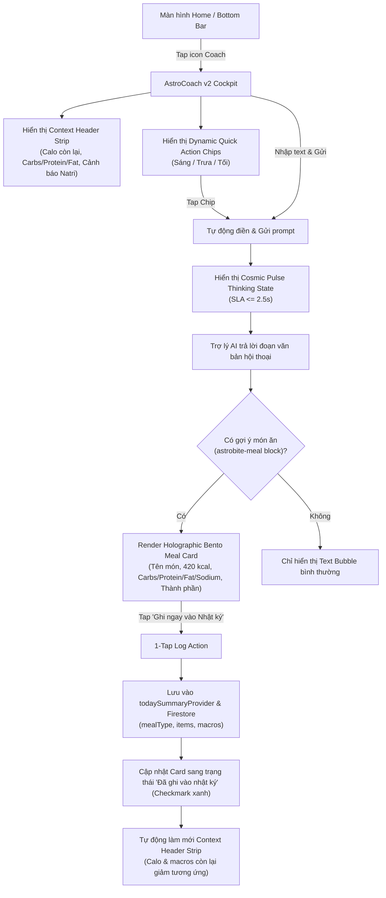

# UI/UX Design Specification — AstroCoach AI Intelligence v2 Cockpit

- **Feature**: `FEAT-16` / `EPIC-18` (AstroCoach AI Intelligence v2 & Conversational Nutritionist)
- **Sub-Agent**: UI/UX Designer (`ui-ux-designer`) — *"The Celestial Aesthetic Purist"*
- **Design System**: Celestial Dark UI (Material 3 + Glassmorphism hybrid)
- **Google Stitch MCP Project**: `projects/4740603587325816667`
- **Generated Screen ID**: `3328fde738f24013a34124bfdecd7484`

---

## 1. Visual Mockup (Google Stitch MCP Ground Truth)


> **Visual Ground Truth**: Mockup sinh trực tiếp qua Google Stitch MCP đồng bộ từ `DESIGN.md`. Dev FE (`flutter-core-dev`) bắt buộc đối soát 100% tỷ lệ, layout và màu sắc từ AppBar đến Bottom theo bản mockup này.

---

## 2. User Flow & Navigation (Mermaid)



---

## 3. Screen Layout Blueprint (Lưới 4pt Chuẩn Công Thái Học)

```
┌────────────────────────────────────────────────────────┐
│ AppBar (H: 56pt, surface #0A192F)                      │
│ [ < Back ]   [Avatar Aura] AstroCoach AI    [Sparkle]  │
│              ● Online • Real-time Nutritionist         │
├────────────────────────────────────────────────────────┤
│ Context Header Strip (GlassCard #112240, Padding: 16pt)│
│ ┌────────────────────────────────────────────────────┐ │
│ │ Tổng quan dinh dưỡng hôm nay       Còn: 650 kcal   │ │
│ │ ────────────────────────────────────────────────── │ │
│ │ Carbs: 45g (Blue) | Protein: 28g (Gold) | Fat: 12g │ │
│ │ ⚠ Cảnh báo Natri: 1,850mg / 2,000mg (Sắp chạm trần) │ │
│ └────────────────────────────────────────────────────┘ │
├────────────────────────────────────────────────────────┤
│ Chat Scroll Area (Padding: 16pt, Spacing: 12pt)        │
│                                                        │
│ [User Bubble (Gradient Blue #1A73E8/20, Align Right)]  │
│ "Tối nay tôi nên ăn gì nhẹ sau tập gym để đủ protein?" │
│                                                        │
│ [AI Assistant Bubble (GlassCard #112240, Align Left)]  │
│ "Dựa vào nhật ký, bạn còn thiếu 28g protein và 650 kcal│
│  Tôi đề xuất bữa tối phục hồi tối ưu:"                │
│                                                        │
│   ┌──────────────────────────────────────────────────┐ │
│   │ Holographic Bento Meal Card (Border Cyan Aura)   │ │
│   │ Ức gà áp chảo quinoa & bông cải xanh   420 kcal  │ │
│   │ [Protein 34g] [Carbs 38g] [Fat 8g] [Natri 210mg] │ │
│   │ Thành phần: 150g ức gà, 100g quinoa, 80g bông cải│ │
│   │ ──────────────────────────────────────────────── │ │
│   │ [ ⚡ Ghi ngay vào Nhật ký (1-Tap Log) ]           │ │
│   └──────────────────────────────────────────────────┘ │
│                                                        │
├────────────────────────────────────────────────────────┤
│ Dynamic Quick Action Chips (H: 36pt, Scroll Horizontal)│
│ [🥗 Bữa tối giàu protein] [⚡ Phân tích natri] [💧 Nước] │
├────────────────────────────────────────────────────────┤
│ Floating Glassmorphic Input Bar (H: 64pt, Docked)     │
│ [ Mic/Sparkle ] [ Input: Hỏi AstroCoach... ] [ Send ➢ ]│
└────────────────────────────────────────────────────────┘
```

---

## 4. 5 Trạng Thái Giao Diện Bắt Buộc (5 UI States)

1. **Default State**:
   - Context Header hiển thị chỉ số calo & 3 macro bars còn lại của ngày hôm nay.
   - Lịch sử chat trước đó (nếu có) hoặc tin nhắn chào mừng thông minh gợi ý hành động.
   - Quick action chips hiển thị theo khung giờ thực tế (Sáng / Trưa / Tối / Đêm).

2. **Loading / Cosmic Pulse State**:
   - Khi người dùng gửi prompt, bong bóng AI xuất hiện hiệu ứng **Cosmic Pulse**:
   - Avatar AstroCoach nhấp nháy nhịp thở nhẹ nhàng (breathing glow), 3 chấm sáng chạy nhịp nhàng với gradient `#1A73E8` -> `#FF69B4`.

3. **Empty State (Chưa có hội thoại)**:
   - Header hiển thị tổng quan calo hôm nay.
   - Card chào mừng: *"Xin chào! Tôi là AstroCoach v2. Hôm nay bạn đã nạp 1,350 kcal. Bạn cần tư vấn bữa ăn nào tiếp theo?"*
   - Danh sách 4 quick prompt chips để bắt đầu hội thoại ngay bằng 1 chạm.

4. **Error / Offline State**:
   - Nếu mất mạng hoặc Gemini timeout (> 10s): Hiển thị snackbar kính mờ và nút "Thử lại tin nhắn".
   - Fallback text: Nếu Gemini trả về text không chứa block JSON `astrobite-meal`, app hiển thị tin nhắn dạng Text Bubble thông thường, không bị crash hoặc vỡ giao diện.

5. **Logged State (Sau khi ấn 1-Tap Log)**:
   - Nút `[⚡ Ghi ngay vào Nhật ký]` chuyển thành `[✓ Đã ghi vào Nhật ký]` với nền màu xanh ngọc / lá cây nhẹ, vô hiệu hóa nút bấm tránh duplicate.
   - Context Header Strip lập tức cập nhật calo & macro còn lại (trừ bớt 420 kcal, 34g protein, v.v.).

---

## 5. Bảng Ánh Xạ Design Tokens (Design System Mapping)

| Thành phần UI | Token Màu / Font | Giá trị Hex / Const | Ghi chú |
| :--- | :--- | :--- | :--- |
| **Nền màn hình** | `AppColors.surface` | `#0A192F` | Midnight Navy sâu thẳm |
| **Thẻ Container / Card** | `AppColors.surfaceContainer` | `#112240` | Deep Navy |
| **Độ mờ kính (Backdrop)** | `AppColors.surfaceBlur` | `0x99192A46` | Sigma blur (20, 20) |
| **Carbs Macro Bar & User Bubble** | `AppColors.carbs` / `primary` | `#1A73E8` | **BẤT BIẾN**: Màu Carbs |
| **Protein Macro Bar & Calorie Tag** | `AppColors.protein` / `tertiary` | `#FFD700` | **BẤT BIẾN**: Màu Protein |
| **Fat Macro Bar** | `AppColors.fat` / `secondary` | `#FF69B4` | **BẤT BIẾN**: Màu Fat |
| **Cảnh báo Natri** | `AppColors.warning` / Amber | `#FFB300` | Cảnh báo vi chất chạm ngưỡng |
| **Nút 1-Tap Log (Active)** | `AppColors.primary` | `#1A73E8` | Glowing pill button |
| **Nút 1-Tap Log (Logged)** | `Colors.tealAccent` / Success | `#00BFA5` | Trạng thái đã ghi nhận |
| **Font gia đình** | GoogleFonts.inter | Inter | Chuẩn toàn ứng dụng |
| **Lưới kích thước** | `AppValues.padding*` | Bội số của 4pt | 4, 8, 12, 16, 24, 32 |
