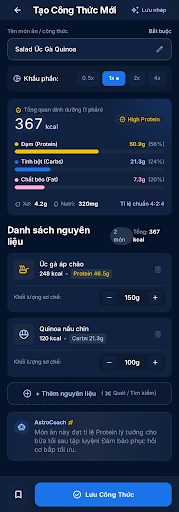

# Hồ Sơ Đặc Tả Thiết Kế Giao Diện (UI/UX Design Specification)
## FEAT-17: Custom Recipes & Meal Planning Architecture (Sprint 10 — v1.9.0)

- **Mã tính năng**: `FEAT-17`
- **Mã Epic**: `EPIC-12` (Custom Recipes & Meal Plans)
- **Tác giả**: Sub-Agent Mobile UI/UX Designer (`ui-ux-designer`) — *"The Celestial Aesthetic Purist"*
- **Tài liệu PRD tham chiếu**: [`docs/03-prd-features/17-custom-recipes-meal-plan/prd-custom-recipes.md`](file:///Users/nguyenduytrang/flutter_project/AstroBite/docs/03-prd-features/17-custom-recipes-meal-plan/prd-custom-recipes.md)
- **Google Stitch Project**: `projects/4740603587325816667` (Screen ID: `c66ce8994c76424f9d6fc094f48636b7`)
- **Ngày hoàn thiện**: 25/09/2026
- **Trạng thái**: 🟡 **Gate 2 Design Completed — Chờ BA & PO Ký Duyệt**

---

## 🧭 1. Sơ Đồ Luồng Điều Hướng Người Dùng (Mermaid Navigation Flow)

```mermaid
graph TD
    classDef page fill:#112240,stroke:#1A73E8,stroke-width:2px,color:#FFFFFF;
    classDef sheet fill:#192A46,stroke:#FFD700,stroke-width:1.5px,color:#FFFFFF;
    classDef action fill:#00E5FF,stroke:#1A73E8,stroke-width:1px,color:#0A192F;
    classDef err fill:#93000A,stroke:#FF69B4,stroke-width:1px,color:#FFFFFF;

    HOME["Home Cockpit / Diary Page"]:::page -->|Tap Tab Kế Hoạch| PLANNER["Meal Planner Page (7-Day Strip)"]:::page
    HOME -->|Tap '+' hoặc Menu| RECIPES["Recipe Library Page"]:::page
    
    RECIPES -->|Tap '+ Tạo Công Thức'| BUILDER["Recipe Builder Page (c66ce899)"]:::page
    PLANNER -->|Tap '+' tại Bữa Ăn| PICKER["Meal / Recipe Selector Sheet"]:::sheet
    PICKER -->|Chọn Công Thức| PLANNER

    subgraph "Màn Hình Recipe Builder"
        BUILDER -->|Nhập Tên Công Thức| INPUT_NAME["Input: Tên món"]:::action
        BUILDER -->|Chọn Khẩu Phần (0.5x, 1x, 2x, 4x)| SCALER["Portion Scaler (Auto Multiply)"]:::action
        BUILDER -->|Tap '+ Thêm Nguyên Liệu'| ADD_ING["Search / Quick Add Sheet"]:::sheet
        ADD_ING -->|Chọn món & gram| BUILDER
        BUILDER -->|Bấm Stepper [-] [+] trên thẻ| ADJUST["Adjust Grams Real-time"]:::action
        BUILDER -->|Bấm Thùng Rác| DELETE["Xóa nguyên liệu"]:::action
        BUILDER -->|Real-time O(N) Calculation| HERO_CARD["Hero Nutrition GlassCard (Calo & 3 Macros)"]:::action
        BUILDER -->|Bấm 'Lưu Công Thức'| VALIDATE{Tên != '' & Items >= 1?}
        VALIDATE -->|Hợp lệ| SAVE_SUCCESS["Lưu Firestore + Local Cache & Toast"]:::action
        VALIDATE -->|Rỗng| ERR_TOAST["Hiển thị viền cảnh báo & SnackBar"]:::err
    end

    subgraph "Meal Planner 1-Tap Log"
        PLANNER -->|Bấm '✓ Ghi Vào Nhật Ký'| OPTIMISTIC["Optimistic Update (<= 100ms)"]:::action
        OPTIMISTIC -->|Tạo MealLog| DIARY_UPDATE["Cập nhật Calo/Macro Home Cockpit"]:::action
        OPTIMISTIC -->|Offline?| QUEUE["Ghi vào Pending Sync Queue"]:::sheet
    end
```

---

## 🎨 2. Bản Vẽ Bố Cục Màn Hình (Screen Layout Blueprint lưới 4pt)

Bản vẽ thiết kế chính thức được trích xuất từ Google Stitch MCP:



### 2.1. Cấu Trúc Khối Giao Diện (Top to Bottom)

```
┌──────────────────────────────────────────────────────────────┐
│ [AppBar 56pt]  ( < )  Tạo Công Thức Mới         [Lưu nháp]   │
├──────────────────────────────────────────────────────────────┤
│ [Card 1: Input & Portion Scaler]                             │
│  Tên công thức: [ Salad Ức Gà Quinoa                    ]    │
│  Khẩu phần:     ( 0.5x )  [ 1x* ]  ( 2x )  ( 4x )            │
├──────────────────────────────────────────────────────────────┤
│ [Hero GlassCard: Real-Time Nutrition Summary - 12px Radius]  │
│  Tổng quan dinh dưỡng (1 phần)       🔥 367 kcal             │
│  🔵 Carbs:   ■■■■■■□□□□□□□□□□□□□□   21.3g (24%)             │
│  🟡 Protein: ■■■■■■■■■■■■■■□□□□□□   50.9g (56%) [High Pro]  │
│  🩷 Fat:     ■■■■□□□□□□□□□□□□□□□□   7.3g  (20%)             │
│  Vi chất: Chất xơ 4.2g • Natri 320mg                         │
├──────────────────────────────────────────────────────────────┤
│ [Section: Danh Sách Nguyên Liệu (2 món)]                     │
│  ┌────────────────────────────────────────────────────────┐  │
│  │ 🍗 Ức gà áp chảo                [-]  150g  [+]    (🗑️) │  │
│  │    248 kcal • Protein 46.5g (🟡)                        │  │
│  └────────────────────────────────────────────────────────┘  │
│  ┌────────────────────────────────────────────────────────┐  │
│  │ 🥣 Quinoa nấu chín              [-]  100g  [+]    (🗑️) │  │
│  │    120 kcal • Carbs 21.3g (🔵)                          │  │
│  └────────────────────────────────────────────────────────┘  │
│                                                              │
│  ┌ - - - - - - - - - - - - - - - - - - - - - - - - - - - - ┐ │
│  │  + Thêm nguyên liệu (Tìm kiếm / Quét mã)                │ │
│  └ - - - - - - - - - - - - - - - - - - - - - - - - - - - - ┘ │
├──────────────────────────────────────────────────────────────┤
│ [AstroCoach Smart Tip]                                       │
│  🤖 "Món ăn đạt tỷ lệ Protein lý tưởng cho phục hồi cơ!"     │
├──────────────────────────────────────────────────────────────┤
│ [Fixed Sticky Bottom CTA 68pt]                               │
│  [================= LƯU CÔNG THỨC =================] (48pt)  │
└──────────────────────────────────────────────────────────────┘
```

---

## 📱 3. Đặc Tả 5 Trạng Thái Giao Diện Bắt Buộc (The 5 Mandatory UI States)

### 1. 🟢 Trạng Thái Mặc Định (Default State)
- Hiển thị đầy đủ tên công thức, chip khẩu phần đang chọn (`1x`), Hero GlassCard với số calo **367 kcal** đậm nét (`letterSpacing: +0.5px`), 3 thanh macro và danh sách các nguyên liệu.
- Nút bấm *"Lưu Công Thức"* sáng rõ với gradient Electric Blue (`#1A73E8`).

### 2. ⚡ Trạng Thái Tải (Skeleton Shimmer State)
- Kích hoạt khi mở công thức có sẵn từ danh bạ hoặc chờ đồng bộ.
- Hiển thị khối Shimmer hiệu ứng ánh sáng chạy ngang (1.5s cycle) qua các vị trí:
  - Khối Hero Card: Hình chữ nhật bo góc 12px màu `AppColors.surfaceContainer` (`#112240`).
  - Danh sách nguyên liệu: 2 thẻ Shimmer dài 64pt.

### 3. ⚪ Trạng Thái Rỗng (Empty State)
- Kích hoạt khi vừa mở màn hình tạo mới (chưa thêm nguyên liệu nào):
  - Hero GlassCard hiển thị: **`0 kcal`**, 3 thanh Macro ở mức 0%, nhãn hướng dẫn: *"Chưa có nguyên liệu nào. Thêm nguyên liệu bên dưới để bắt đầu tính toán!"*.
  - Khung danh sách hiển thị biểu tượng vũ trụ mờ `Icons.science_outlined` với nút bấm viền đứt `+ Thêm nguyên liệu đầu tiên`.

### 4. 🔴 Trạng Thái Lỗi & Ràng Buộc (Error / Validation State)
- Kích hoạt khi người dùng nhấn *"Lưu Công Thức"* mà để trống tên món hoặc danh sách có 0 nguyên liệu:
  - Viền ô nhập tên món đổi sang màu cảnh báo `AppColors.error` (`#FFB4AB`).
  - Rung nhẹ phản hồi (HapticFeedback: lightImpact).
  - Hiển thị SnackBar mờ kính: *"Vui lòng nhập tên công thức và ít nhất 1 nguyên liệu!"*.

### 5. ☁️ Trạng Thái Ngoại Tuyến (Offline State)
- Kích hoạt khi người dùng ở chế độ mất mạng hoặc bật Airplane Mode:
  - Góc trên màn hình hiển thị badge nhỏ màu xám ánh sao: `☁️ Ngoại tuyến`.
  - Khi nhấn *"Lưu Công Thức"*, hệ thống lưu tức thì vào Local Cache (SharedPreferences / SQLite) và thông báo: *"✓ Đã lưu công thức cục bộ (Sẽ tự động đồng bộ khi có mạng)"*.

---

## 🎨 4. Bảng Ánh Xạ Design Tokens & Reusable Widgets

### 4.1. Màu sắc bất biến (Celestial Dark UI Tokens)
| Thành phần giao diện | Token Flutter | Mã Màu Hex | Quy Chuẩn Ngữ Nghĩa |
| :--- | :--- | :---: | :--- |
| **Nền Scaffold chính** | `AppColors.surface` | `#0A192F` | Nền xanh đêm Midnight, chống chói mắt |
| **Bề mặt thẻ nổi (Cards)** | `AppColors.surfaceContainer` | `#112240` | Deep Navy, bo góc 12px, padding 16pt |
| **Lớp phủ kính mờ** | `AppColors.surfaceBlur` | `rgba(25, 42, 70, 0.6)` | Kết hợp `BackdropFilter.blur(20, 20)` |
| **Carbohydrates Indicator** | `AppColors.primary` | `#1A73E8` | **Bất biến**: Thanh Carbs & Nút CTA chính |
| **Protein Indicator** | `AppColors.tertiary` | `#FFD700` | **Bất biến**: Thanh Protein & Huy hiệu High-Protein |
| **Fat Indicator** | `AppColors.secondary` | `#FF69B4` | **Bất biến**: Thanh Fat |
| **Viền kính ánh sao** | `AppColors.glassBorder` | `rgba(255, 255, 255, 0.08)` | Viền 1px trên các thẻ GlassCard |

### 4.2. Tái sử dụng Shared Widgets (Kỷ Luật Ponytail - Zero Bloat)
1. **`GlassCard`** ([`lib/shared/widgets/glass_card.dart`](file:///Users/nguyenduytrang/flutter_project/AstroBite/lib/shared/widgets/glass_card.dart)): Làm khung bao bọc Hero Nutrition Card và các thẻ nguyên liệu.
2. **`MacroBar`** ([`lib/shared/widgets/macro_bar.dart`](file:///Users/nguyenduytrang/flutter_project/AstroBite/lib/shared/widgets/macro_bar.dart)): Hiển thị thanh tỷ lệ 3 chất dinh dưỡng chuẩn màu không viết lại code.
3. **`MealTypeChip`** ([`lib/shared/widgets/meal_type_chip.dart`](file:///Users/nguyenduytrang/flutter_project/AstroBite/lib/shared/widgets/meal_type_chip.dart)): Tái sử dụng cho bộ lọc 4 bữa ăn trên màn hình Meal Planner.
4. **`SkeletonLoader`** ([`lib/shared/widgets/skeleton_loader.dart`](file:///Users/nguyenduytrang/flutter_project/AstroBite/lib/shared/widgets/skeleton_loader.dart)): Dùng trực tiếp cho hiệu ứng Shimmer khi load.

---

## 🛠️ 5. Hướng Dẫn Kỹ Thuật Handoff Bàn Giao Dev FE & QA

### 5.1. Dành cho Dev FE (`flutter-core-dev`)
- **Tạo phân hệ mới**: `lib/features/recipes/` theo Clean Architecture:
  - `domain/models/recipe.dart`, `domain/models/recipe_ingredient.dart` (Freezed).
  - `domain/models/meal_plan_item.dart` (Freezed).
  - `presentation/controllers/recipe_builder_controller.dart` (`@riverpod`).
  - `presentation/pages/recipe_builder_page.dart` (`@RoutePage()`).
  - `presentation/pages/meal_planner_page.dart` (`@RoutePage()`).
- **Thuật toán tổng hợp Macro O(N)**:
  - Chạy hàm tổng hợp `computeTotals()` mỗi khi danh sách `ingredients` hoặc `servings` thay đổi. Vì số nguyên liệu <= 30 nên tính trực tiếp trên Main Isolate mà không gây giật lag (< 1ms).

### 5.2. Dành cho QA Tester (`qa-tester`)
- Biên soạn kịch bản kiểm thử bao phủ toàn bộ 5 trạng thái giao diện và các ca kiểm thử biên (BVA: 0g, 1000g, 0 nguyên liệu, số lẻ thập phân).
- Xác minh độ trễ phản hồi UI của nút 1-Tap Log đạt yêu cầu <= 100ms.
