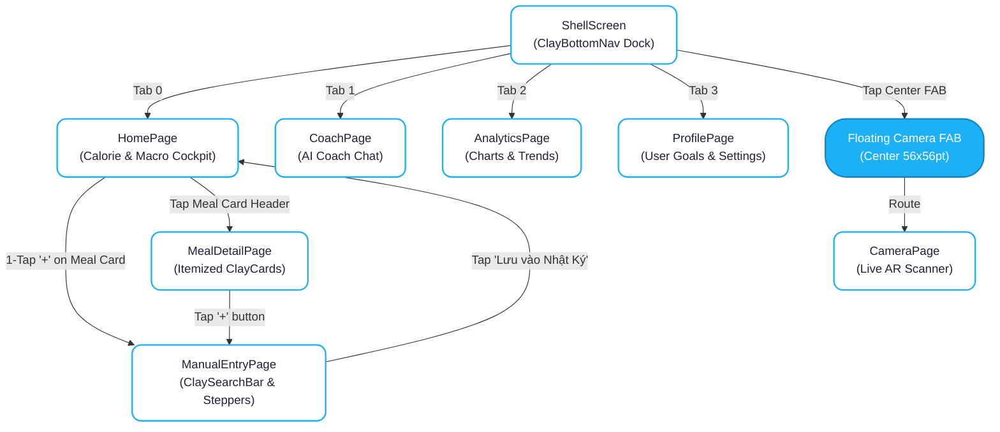

# 🎨 UI/UX Design Specification: Core Daily Loop (Navigation & Food Tracker)

- **Feature Code**: `FEAT-S13-TRACKER-NAV`
- **Design System**: Claymorphic × Duolingo 2D/3D (Warm Milk Canvas & Tactile Surfaces)
- **Author**: Sub-Agent Mobile UI/UX Designer (`ui-ux-designer`)
- **Reviewers**: Sub-Agent Business Analyst (`business-analyst`) & Sub-Agent Product Owner (`product-owner`)
- **Status**: 🟢 **Gate 2 SIGNED-OFF**

---

## 1. Sơ Đồ Luồng Điều Hướng (Mermaid Navigation Flow)

---

## 2. Bản Vẽ Bố Cục Màn Hình (Screen Layout Blueprints & 4pt Grid)

### 2.1 Màn hình 1: `ShellScreen` & `ClayBottomNav`
- **Vị trí**: Cố định đáy màn hình với khoảng cách nổi `margin: EdgeInsets.fromLTRB(16, 0, 16, 16)`.
- **Dock Container**:
  - Nền: `AppColors.surfaceContainer` (`#FFFFFF`).
  - Bo góc: `24pt`.
  - Độ dày bóng 2D: `Offset(0, 8), blur 16, color: Colors.black.withValues(alpha: 0.08)` kết hợp `Offset(0, 3.5), blur 0, color: Color(0xFFD6D1C7)`.
  - Chiều cao: `68pt`.
- **4 Tab Items**:
  - Touch target: `48x48pt`.
  - Active color: `AppColors.primary` (`#1CB0F6`).
  - Inactive color: `AppColors.onSurfaceVariant` (`#78829A`).
  - Tactile squash: scale `0.95` trong `100ms` khi chạm.
- **Center Floating Camera FAB**:
  - Kích thước: `56x56pt` tròn nổi.
  - Vị trí: Nhô cao hơn dock `12pt`.
  - Nền: `AppColors.primary` (`#1CB0F6`) với viền dưới 3D bevel `Color(0xFF1586BD)`.
  - Icon: `Icons.photo_camera_rounded`, màu trắng tinh `28pt`.

---

### 2.2 Màn hình 2: `HomePage` (Cockpit & Meal Timeline)
- **Scaffold**: Nền Warm Milk `AppColors.surface` (`#FAF8F5`).
- **Header**: Lời chào thân thiện kèm ngày tháng hiện tại, nút chọn ngày (Previous / Next day).
- **Khối 1: Calorie & Macro Cockpit Card (`ClayCard`)**:
  - Margin: `horizontal 16pt, vertical 8pt`.
  - Bố cục 2 cột (Row):
    - **Cột trái (40% width)**: `CalorieProgressArc` đường kính `140pt`.
      - Vòng ngoài: `AppColors.brandGreen` (`#58CC02`) hoặc `AppColors.primary` biểu thị tiến độ nạp calo.
      - Tâm vòng: Số calo lớn `headlineMedium` (`24pt Bold`), chữ "Kcal còn lại" nhỏ `11pt`.
    - **Cột phải (60% width)**: 3 thanh `ChunkyMacroBar` xếp chồng dọc:
      - 🩵 **Carbs**: `AppColors.primary` (`#1CB0F6`) — Chiều cao thanh `12pt`, bo góc `6pt`.
      - 🍓 **Fat**: `AppColors.secondary` (`#FF5C8D`) — Chiều cao thanh `12pt`, bo góc `6pt`.
      - 🧡 **Protein**: `AppColors.tertiary` (`#FF9600`) — Chiều cao thanh `12pt`, bo góc `6pt`.
- **Khối 2: Meal Timeline (4 Thẻ Bữa Ăn)**:
  - 4 bữa: Bữa Sáng (Breakfast), Bữa Trưa (Lunch), Bữa Tối (Dinner), Bữa Phụ (Snacks).
  - Tông màu nền pastel đặc trưng (`ClayCard`):
    - Sáng: `clayBreakfast` (`#FFF2D6`)
    - Trưa: `clayLunch` (`#E5F6FD`)
    - Tối: `clayDinner` (`#F0E8FF`)
    - Phụ: `claySnack` (`#FFE8EE`)
  - Bên phải thẻ: Nút tròn `+` Quick Log kích thước `44x44pt` chuẩn Thumb Zone.

---

### 2.3 Màn hình 3: `ManualEntryPage` (Ergonomic Food Entry)
- **Top Bar**: Nút Back `ClayIconButton`, tiêu đề "Thêm Món Ăn Thủ Công".
- **Khu vực Tìm Kiếm**:
  - `ClaySearchBar` chiều cao `52pt`, viền mềm, icon kính lúp, tự động xóa ký tự bằng nút `x`.
- **Khu vực Chọn Bữa**:
  - Hàng cuộn ngang `ClayMealChip` (Sáng, Trưa, Tối, Phụ) để đổi bữa nhanh mà không phải quay lại Home.
- **Khu vực Nhập Liệu & Steppers**:
  - Ô nhập tên món & ô nhập gram: `ClayTextField` nền trắng, nhãn nổi rõ ràng.
  - Hàng Quick Weight Steppers: 4 nút 3D Duolingo:
    - `-50g`, `+50g`, `1 Bát (150g)`, `1 Đĩa (250g)` dạng `ClayButton.ghost` hoặc `ClayButton.secondary`.
- **Thanh Hành Động Cố Định (Sticky Bottom CTA)**:
  - Nút "Lưu vào Nhật Ký" `ClayButton.primary` full width, chiều cao `54pt`, bo góc `16pt`, viền dưới 3D bevel `4pt`.

---

### 2.4 Màn hình 4: `MealDetailPage` (Itemized Meal Breakdown)
- **Header**: Tiêu đề bữa ăn kèm tổng calo & thời gian ăn.
- **Danh sách món**:
  - Mỗi món là một thẻ `ClayCard` nền trắng tinh.
  - Hiển thị: Tên món, số lượng gram, tổng calo.
  - Bên dưới tên món: Mini `ChunkyMacroBar` mỏng `6pt` hiển thị tỷ lệ 3 chất Carbs/Fat/Protein.
  - Nút xóa món: `ClayIconButton` icon thùng rác viền mềm.

---

## 3. Đặc Tả 5 Trạng Thái Giao Diện Bắt Buộc

1. **Default State**: Render đầy đủ Cockpit với số liệu calo, 4 thẻ bữa ăn và danh sách món với hiệu ứng 3D bevel.
2. **Loading Shimmer State**: Khung xương `ClaySkeletonLoader` với dải quét shimmer màu kem ấm `#EFF1F5` (thay vì dải đen xỉn cũ).
3. **Empty State**: Thẻ `ClayCard` bo góc `20pt` với minh họa icon dĩa thìa thân thiện, thông điệp: "Hôm nay bạn chưa ghi món nào. Chạm '+' để thêm ngay nhé!"
4. **Error State**: Thẻ card thông báo lỗi màu hồng kem nhẹ `#FFE8EE` với nút "Thử Lại" `ClayButton.secondary`.
5. **Offline State**: Thanh thông báo Claymorphic nổi màu vàng kem `#FFF2D6` ở đỉnh màn hình: "Đang lưu tạm offline. Dữ liệu sẽ đồng bộ tự động khi có mạng."

---

## 4. Bảng Ánh Xạ Tokens & Shared Components Handoff cho Dev FE

| Thành phần UI | Widget Tái Sử Dụng | Token Màu / Thuộc Tính | Ghi Chú Handoff cho Dev FE |
|:---|:---|:---|:---|
| Nền toàn màn hình | `Scaffold` | `AppColors.surface` (`#FAF8F5`) | Đặt `surfaceTintColor: Colors.transparent` |
| Thanh điều hướng đáy | `ClayBottomNav` | `AppColors.surfaceContainer` (`#FFFFFF`) | Tích hợp vào `ShellScreen.bottomNavigationBuilder` |
| Nút Camera chính giữa | `ClayBottomNav` FAB | `AppColors.primary` (`#1CB0F6`) | Bấm mở `CameraRoute` |
| Thẻ Cockpit & Món ăn | `ClayCard` | Bo góc 20pt, 2 tầng BoxShadow 2D | Hỗ trợ thuộc tính `tintColor` cho 4 bữa |
| Vòng tròn năng lượng | `CalorieProgressArc` | `AppColors.brandGreen` / `AppColors.primary` | Animation tween mượt mà |
| Thanh macro 3 chất | `ChunkyMacroBar` | Carbs 🩵, Fat 🍓, Protein 🧡 | Height 12pt, radius 6pt |
| Ô tìm kiếm món | `ClaySearchBar` | Bo góc 20pt, controller & onChanged | Tích hợp tìm kiếm lọc danh sách |
| Nút bấm 3D chính | `ClayButton` | Type `.primary` / `.secondary` | Có squash scale 0.98 và 3D bottom bevel |
| Nút icon tròn | `ClayIconButton` | Kích thước 44x44pt | Dùng cho Back, Delete, Close |
| Chip chọn bữa ăn | `ClayMealChip` | Type Breakfast, Lunch, Dinner, Snack | Màu pastel động tương ứng |
| Khung xương chờ | `ClaySkeletonLoader`| Base color `#EFF1F5`, highlight `#F7F8FA` | Không dùng nền đen cũ |
