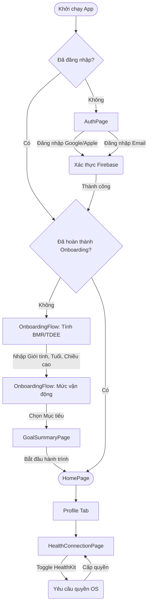

# 🎨 UI/UX Design Spec: First Impression & Identity (`FEAT-S15-FTUX`)

- **Feature Code**: `FEAT-S15-FTUX`
- **Epic**: `EPIC-UI-REFRESH` (Solar Fresh × Duolingo 2D/3D Claymorphic)
- **Author**: Sub-Agent UI/UX Designer (`ui-ux-designer`) — *"The Celestial Aesthetic Purist"*
- **Lưới thiết kế**: Lưới 4pt nghiêm ngặt
- **Trạng thái**: 🟡 **Gate 2 SUBMITTED FOR SIGN-OFF**

---

## 1. Sơ đồ luồng người dùng (User Flow)



---

## 2. Layout Blueprint (4pt Grid System)

### 2.1 AuthPage Layout (Màn hình đăng nhập)
```text
[Màn hình nền: Warm Milk #FAF8F5]
+---------------------------------------------------+
| [Padding Top: 64pt]                               |
| Lottie Animation (Phi hành gia vẫy tay) 200x200pt |
|                                                   |
| [Padding: 32pt]                                   |
| Text H1: "Chào mừng đến AstroBite" (Inter 28pt)   |
| Text Body: "Hành trình dinh dưỡng bắt đầu" (16pt) |
|                                                   |
| [Padding: 24pt]                                   |
| ClayCard (Bảng đăng nhập) - Bán kính 20pt         |
|   +-------------------------------------------+   |
|   | Padding trong: 24pt                       |   |
|   | ClayTextField: Email (Cao 56pt)           |   |
|   | [Gap: 16pt]                               |   |
|   | ClayTextField: Password (Cao 56pt)        |   |
|   | [Gap: 24pt]                               |   |
|   | ClayButton.primary: Đăng Nhập (Cao 56pt)  |   |
|   +-------------------------------------------+   |
|                                                   |
| [Gap: 24pt]                                       |
| Text: "Hoặc đăng nhập với"                        |
|                                                   |
| Row [Gap: 16pt]                                   |
|   ClayIconButton (Google) - 56x56pt               |
|   ClayIconButton (Apple)  - 56x56pt               |
+---------------------------------------------------+
```

### 2.2 OnboardingFlow & GoalSummaryPage Layout
- **Thẻ lựa chọn (QuickChoiceChips)**: Chiều cao tối thiểu $44\text{pt}$, padding ngang $16\text{pt}$, border radius $24\text{pt}$ (dạng viên thuốc Pill).
- **GoalSummaryPage**:
  - Trung tâm là biểu đồ `CalorieProgressArc` khổng lồ (Kích thước $240\times 240\text{pt}$).
  - Hiển thị Text to bản: `2,150 kcal` (Font Outfit, 48pt, đậm).
  - 3 thanh tiến độ nhỏ bên dưới đại diện cho Carbs, Fat, Protein.
  - CTA Button: `ClayButton.primary` bám đáy (Thumb zone), margin ngang $24\text{pt}$, margin đáy $32\text{pt}$.

---

## 3. Bản đồ Design Tokens (Solar Fresh Claymorphic)

Tuyệt đối không sử dụng mã Hex rời rạc, mọi thành phần UI phải trỏ tới `AppColors`.

| Component | Design Token (Theme) | Semantic Color / Giá trị |
|:---|:---|:---|
| Nền toàn trang | `AppColors.surface` | Warm Milk `#FAF8F5` |
| Nền thẻ đăng nhập | `AppColors.surfaceContainer` | Pure White `#FFFFFF` |
| Nút bấm chính (Đăng nhập) | `AppColors.primary` | Duolingo Sky Blue `#1CB0F6` |
| Viền nổi (Clay Border) | `AppColors.outline` | Soft Clay Edge `#E8E5DF` |
| Text Tiêu đề (H1) | `AppColors.onSurface` | Deep Slate Berry `#1E2337` |
| Text Phụ (Body) | `AppColors.onSurfaceVariant`| Cool Slate `#78829A` |
| Nút Health Connect Bật | `AppColors.brandGreen` | Duolingo Lime Green `#58CC02` |
| Nút Health Connect Tắt | `AppColors.surfaceContainerHighest` | Xám nhạt `#F2F0EB` |
| Bo góc Thẻ (Card Radius) | `AppValues.radiusFat` | `20.0` |
| Touch Target Tối thiểu | `AppValues.minTouchTarget` | `44.0` |

---

## 4. Đặc tả 5 Trạng thái (5 UI States) cho Developer

1. **Default State**:
   - Các nút bấm 3D (`ClayButton`, `ClayIconButton`) hiển thị độ nổi (Elevation) là $8\text{pt}$ và bóng đổ 2 lớp (shadow + drop shadow).
   - Khi ấn xuống (Press): Nút lún xuống (Tactile Squash) với scale `0.95` và elevation giảm còn $2\text{pt}$. Kèm rung Haptic `lightImpact`.
2. **Loading State**:
   - Khi bấm Đăng nhập: Nút bấm hiển thị vòng quay `CupertinoActivityIndicator` màu trắng bên trong nút, text đổi thành "Đang xử lý...".
   - Màn hình không bị chặn hoàn toàn nhưng các input bị mờ đi (Opacity $0.5$).
3. **Empty State**:
   - Nếu Profile chưa có dữ liệu kết nối Health: Hiển thị icon trái tim vỡ hoặc ổ cắm bị rút, text màu xám "Chưa có thiết bị nào được kết nối".
4. **Error State**:
   - Lỗi đăng nhập: Khung `ClayTextField` rung nhẹ (Shake animation 500ms) và viền đổi màu Đỏ (`AppColors.error`).
   - Snackbar báo lỗi nổi lên từ cạnh dưới, có viền bo tròn $16\text{pt}$, nổi trên thẻ Navigation.
5. **Offline State**:
   - Nếu vào AuthPage mà mất mạng: Toàn bộ nút Đăng nhập bị làm xám (Disabled).
   - Nếu vào ProfilePage mất mạng: Vẫn cho xem Profile (dữ liệu Cache từ SharedPreferences), nhưng mờ nút "Cập nhật". Hiển thị banner vàng nhạt trên cùng: "Đang xem dữ liệu ngoại tuyến".
