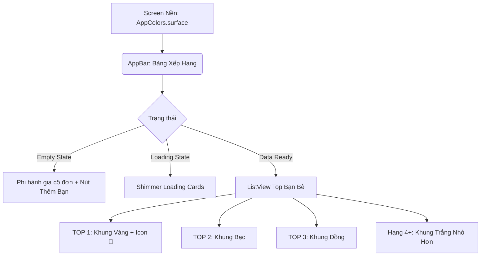

# UI/UX Blueprint: Sprint 17 Social & Leaderboard

- **Người thiết kế**: Sub-Agent UI/UX Designer
- **Cổng chất lượng**: Gate 2 Sign-Off
- **Design System**: Claymorphic UI

## 1. Share Card Blueprint (Thẻ Khoe Thành Tích)
Thẻ này không có tương tác tĩnh, nó sẽ được bọc bởi `RepaintBoundary` để xuất thành ảnh.

**Kích thước chuẩn**: Khung vuông 1080x1080 (chuẩn Instagram Post) hoặc khung dọc 1080x1920 (chuẩn Instagram Story).
**Quy tắc Lưới (4pt Grid)**:
- Nền ngoài cùng: Gradient của `AppColors.surface` sang `AppColors.clayLunch` để bức ảnh có chiều sâu.
- Nền Thẻ chính (ClayCard): `AppColors.surfaceContainer` (#FFFFFF), `20pt` fat corner radius, shadow nổi 3D.
- Padding thẻ: `32pt` mọi cạnh.

**Thành phần hiển thị**:
1. **Header**: Logo AstroBite + "Nhật Ký Ăn Uống Của @Username". Text màu Deep Slate Berry (`AppColors.onSurface`).
2. **Hero Image**: Vòng cung tiến độ CalorieProgressArc siêu to khổng lồ ở trung tâm (màu Sky Blue `#1CB0F6` nếu đạt mục tiêu, màu Honey Tangerine `#FF9600` nếu vượt quá).
3. **Chunky Bar**: Thanh tiến độ 3 màu dinh dưỡng (Carb, Fat, Protein).
4. **Footer**: Dòng chữ "Tham gia cùng tôi trên AstroBite bằng mã: `ASTRO123`" màu Cool Slate (`AppColors.onSurfaceVariant`).

## 2. Astro Leaderboard Blueprint
Màn hình danh sách bạn bè và thứ hạng.

**Kiến trúc Layout**:

**Thẻ Hạng (Leaderboard Card)**:
- Background: `AppColors.surfaceContainer` cho hạng thường. Riêng Top 1 có nền tint nhẹ `clayBreakfast` (#FFF2D6).
- Padding: `16pt`. Margin: `8pt` giữa các thẻ.
- Trạng thái Lún (Active State): Scale `0.98` kèm hiệu ứng bóng đổ bị xẹp khi bấm vào xem chi tiết bạn bè (Duolingo 3D button feel).

## 3. Màu Sắc (Color Tokens)
Tuyệt đối tuân thủ `AppColors.dart`:
- Nền màn hình: `#FAF8F5`
- Primary (Xanh ngọc/Carbs/Đạt mục tiêu): `#1CB0F6`
- Trắng Clay: `#FFFFFF`
- Chữ chính: `#1E2337`
- Huy chương Vàng: `#FFD700`

> 🟢 **Gate 2 UI/UX Sign-Off**: Blueprint đã phủ 100% PRD. Sẵn sàng bàn giao cho QA Tester.
