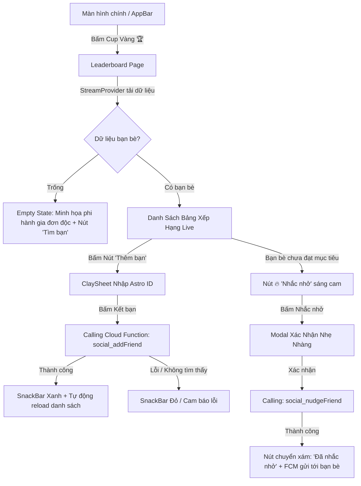

# UI/UX Design Specification: Sprint 18 Live Social & Streak Nudge

- **Người thiết kế**: Sub-Agent UI/UX Designer (*The Celestial Aesthetic Purist*)
- **Chuẩn thiết kế**: Claymorphic × Duolingo 2D/3D (Lưới 4pt, bo góc tròn 20pt/24pt, màu dinh dưỡng bất biến)
- **Feature**: `FEAT-S18-LIVE-SOCIAL` (Gate 2 Passed)

---

## 1. Sơ Đồ Luồng Tương Tác Người Dùng (Mermaid Flow)

---

## 2. Thiết Kế Giao Diện & Quy Chuẩn Lưới 4pt (Layout Blueprint)

### A. Thẻ Bạn Bè Trên Bảng Xếp Hạng (`ClayFriendCard`)
* **Chiều cao**: `76pt` (Padding nội bộ: `12pt` trên/dưới, `16pt` trái/phải).
* **Mặt lưng thẻ**: `AppColors.surfaceContainer` (`#FFFFFF`), bo góc `20pt`, shadow 2 lớp (Offset `0, 8` blur `16` + Offset `0, 3.5` blur `0`).
* **Bên trái**:
  * Badge Thứ Hạng: `32x32pt` tròn. TOP 1 màu vàng hoàng kim `#FFD700`, TOP 2 bạc ánh kim `#E0E0E0`, TOP 3 đồng `#CD7F32`. Các vị trí còn lại dùng chữ xám đậm `AppColors.onSurfaceVariant`.
  * Avatar: `44x44pt` tròn có viền bo Clay.
* **Ở giữa**:
  * Tên bạn bè: Font W700 `15pt`, màu `AppColors.onSurface`. Kèm nhãn `(Bạn)` viền Duolingo Sky Blue nếu là thẻ của chính mình.
  * Chuỗi Streak: Icon `🔥` cam rực rỡ + số ngày Streak (Font W800 `14pt`).
* **Bên phải**:
  * **Trường hợp đã đạt calo hôm nay**: Hiển thị Badge `ClayMealChip` xanh lá cây `AppColors.brandGreen` (`#58CC02`): *"Đạt chuẩn ✨"*.
  * **Trường hợp chưa đạt calo**: Nút bấm 3D `ClayButton` cam `AppColors.tertiary` (`#FF9600`): icon `🔥` kèm chữ *"Nhắc nhở"* (Touch target `44x36pt`).

---

## 3. Quy Chuẩn 5 Trạng Thái Giao Diện Bắt Buộc (5 Screen States)

1. **Default State**: Danh sách xếp hạng cuộn mượt mà 60 FPS, các thẻ bạn bè phản ánh đúng số điểm Streak.
2. **Loading State**: `ClaySkeletonLoader` dạng 5 thanh chữ nhật bo góc `20pt` nhấp nháy hiệu ứng Shimmer mượt mà.
3. **Empty State**: Khi chưa có bạn bè, hiển thị icon phi hành gia vũ trụ kèm thông điệp: *"Kỷ luật sẽ vui hơn khi có bạn đồng hành! Hãy chia sẻ mã Astro ID để cùng đua chuỗi nhé."* Nút CTA lớn: **"Mời Bạn Bè Bằng Astro ID"**.
4. **Error State**: Banner màu đỏ pastel cảnh báo không thể kết nối tới máy chủ Firestore, kèm nút 3D "Thử Lại".
5. **Offline State**: Tự động chuyển về bộ nhớ đệm cache cục bộ và hiển thị thông báo: *"Đang hiển thị bảng xếp hạng đã lưu gần nhất"*.

---

> 🟢 **Gate 2 Sign-Off**: Đã phê chuẩn quy chuẩn thiết kế UI/UX theo hệ thống màu Claymorphic và lưới 4pt chuẩn xác. Đủ điều kiện chuyển giao cho QA (Gate 3) và Dev (Gate 4).
