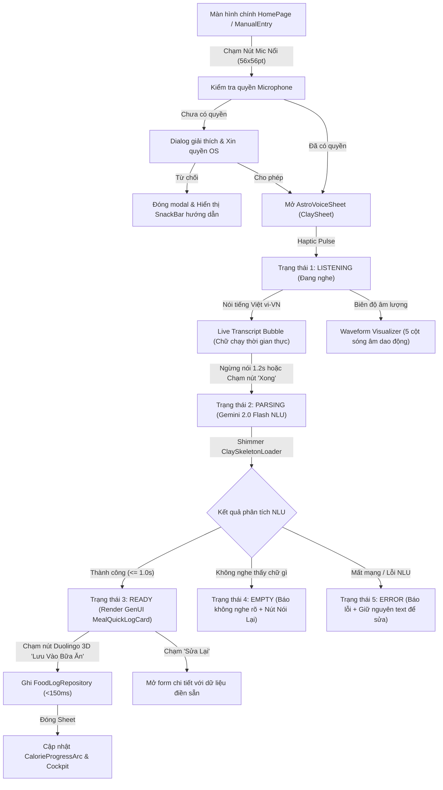

# Đặc Tả Thiết Kế Giao Diện Gate 2 (UI/UX Design Specification)
# Hands-Free Voice Logging (AstroVoice AI)

- **Mã Epic**: `EPIC-VOICE`
- **Mã Feature**: `FEAT-S20-VOICE-LOG`
- **Người thiết kế**: Sub-Agent UI/UX Designer (`ui-ux-designer`) — *The Celestial Aesthetic Purist*
- **Người kiểm soát chéo**: Sub-Agent BA (`business-analyst`) & Sub-Agent PO (`product-owner`)
- **Phiên bản mục tiêu**: `v3.0.0`
- **Trạng thái**: 🟡 Submitted for Gate 2 Four-Eyes Sign-Off

---

## 1. Sơ Đồ Luồng Người Dùng Trực Quan (Mermaid User Flow)



---

## 2. Bản Vẽ Bố Cục Giao Diện (Screen Layout Blueprint - Lưới 4pt)

### A. Nút Kích Hoạt Mic Nổi (`VoicePulsingMicButton`)
- **Vị trí**: Nằm cố định góc dưới bên phải màn hình `HomePage` (cách lề phải `16pt`, cách bottom navigation `24pt`).
- **Kích thước**: `56x56pt` (đáp ứng vượt chuẩn touch target `44x44pt`).
- **Hình thức**: Hình tròn bo tròn `28pt`, nền gradient Duolingo Sky Blue (`#1CB0F6` ➔ `#0288D1`), icon `Icons.mic_rounded` màu trắng `28pt`.
- **Hiệu ứng thị giác (Pulsing Ripple)**: 2 vòng sóng âm tỏa ra xung quanh với opacity `0.3` và `0.15`, chu kỳ lan tỏa `2.0s` êm ái khi ở màn hình chính để mời gọi tương tác.

```
┌──────────────────────────────────────────────────┐
│                   AstroBite                      │
│                                                  │
│   [Cockpit CalorieProgressArc & ChunkyMacroBar]  │
│                                                  │
│   [Timeline 4 Bữa Ăn: Sáng, Trưa, Tối, Phụ]      │
│                                                  │
│                                                  │
│                                        ( ( 🎙️ ) )│ ➔ Nút Mic Nổi (56x56pt)
│ ┌──────────────────────────────────────────────┐ │
│ │  🏠 Home       📊 Analytics     👤 Profile   │ │
└─┴──────────────────────────────────────────────┴─┘
```

---

### B. Cấu Trúc Bố Cục Modal Sheet (`AstroVoiceSheet`)
Được thiết kế dựa trên `ClaySheet` nền trắng tinh khiết (`#FFFFFF`) với fat corner radius `24pt`, chiều cao co giãn linh hoạt (`380pt – 460pt`):

```
┌────────────────────────────────────────────────────────┐
│                      ─── [Drag Handle: 40x4pt]         │
│                                                        │
│  [Tiêu đề] 🎙️ AstroVoice AI                           │
│  [Phụ đề] Nói tự nhiên bữa ăn của bạn bằng tiếng Việt  │
│  ────────────────────────────────────────────────────  │ (divider: 1pt outline)
│                                                        │
│  [Vùng Trạng Thái Thay Đổi Theo 5 States]              │
│                                                        │
│  ┌──────────────────────────────────────────────────┐  │
│  │  Live Transcript Bubble                          │  │
│  │  "Sáng nay ăn 1 tô phở bò tái nạm, 2 quẩy..."    │  │ (Nền clayLunch #E5F6FD)
│  └──────────────────────────────────────────────────┘  │
│                                                        │
│       |||  |||  |||||  |||  ||   (Animated Waveform)   │
│                                                        │
│  ┌──────────────────────────────────────────────────┐  │
│  │  GenUI Card: MealQuickLogCard (Khi Ready)        │  │
│  │  🍜 Phở Bò Tái Nạm (635 kcal)                    │  │
│  │  Carbs 65g 🩵 | Fat 16g 🍓 | Protein 28g 🧡       │  │
│  └──────────────────────────────────────────────────┘  │
│                                                        │
│  [Nút Đóng / Nói Lại]   [Nút 3D Duolingo: ⚡ Lưu Vào]   │
└────────────────────────────────────────────────────────┘
```

---

## 3. Đặc Tả 5 Trạng Thái Màn Hình Bắt Buộc (The 5 States of AstroVoice)

### Trạng Thái 1: LISTENING (Đang Lắng Nghe Giọng Nói)
- **Hiệu ứng Micro**: Icon Mic ở giữa màn hình sheet với 3 vòng sóng âm `PulsingRipple` màu Duolingo Sky Blue (`#1CB0F6`) co giãn theo âm lượng giọng nói.
- **Waveform Visualizer**: 5 cột sóng âm chuyển động mượt mà `60 FPS` với các chiều cao ngẫu nhiên tự nhiên (`12pt` đến `40pt`).
- **Live Transcript**: Bong bóng nền Pastel `clayLunch` (`#E5F6FD`), chữ màu `AppColors.onSurface` (`#1E2337`), font nghiêng nhẹ `15pt`, cập nhật từng chữ khi người dùng cất giọng.
- **Nút hành động**: Nút tròn đỏ nhẹ `[■ Dừng]` để chủ động ngắt nếu không muốn chờ timeout 1.2s.

### Trạng Thái 2: PARSING (Gemini 2.0 Flash Đang Phân Tích)
- **Thị giác**: Sóng âm ngừng dao động và chuyển sang hiệu ứng xoay tròn nhẹ `CircularProgressIndicator` màu xanh Sky Blue.
- **Bong bóng text**: Chuyển sang font đứng đậm, xác nhận câu nói hoàn chỉnh.
- **Thông điệp**: Hiệu ứng chuyển động mờ dần (Fade transition): *"AstroBite AI đang tính toán calo & dinh dưỡng..."*.
- **Thời gian**: Siêu tốc từ **0.8s – 1.0s**, không để người dùng chờ đợi quá 1.5s.

### Trạng Thái 3: READY (Kết Quả Sẵn Sàng Lưu - Thành Công)
- **Thị giác**: Rung haptic nhẹ (`HapticFeedback.lightImpact()`), xuất hiện thẻ `MealQuickLogCard` với hiệu ứng trượt nhẹ từ dưới lên (`SlideTransition` + `FadeTransition` trong `250ms`).
- **Thành phần trên thẻ**:
  - Tên món ăn và khẩu phần ước tính (VD: *Phở Bò Tái Nạm - 1 Tô to (600g)*).
  - Chip bữa ăn: `ClayMealChip` màu Pastel theo bữa (`clayBreakfast` sáng, `clayLunch` trưa...).
  - Vòng tròn ngân sách calo & 3 thanh `ChunkyMacroBar` với màu sắc bất biến (Carbs `#1CB0F6`, Fat `#FF5C8D`, Protein `#FF9600`).
- **Nút bấm hành động**:
  - Nút chính: `ClayButton` màu xanh Duolingo Lime Green (`#58CC02`) viền 3D dày 4pt: `[⚡ Lưu Vào Bữa Sáng (635 kcal)]`.
  - Nút phụ: Nút phẳng màu xám nhạt `[✏️ Điều Chỉnh]` dẫn sang `ScanReviewPage` nếu muốn sửa thủ công.

### Trạng Thái 4: EMPTY (Không Nhận Diện Được Âm Thanh)
- **Thị giác**: Icon phi hành gia đeo tai nghe ngơ ngác hoặc icon `Icons.mic_off_rounded` màu xám Cool Slate (`#78829A`).
- **Thông điệp**: *"AstroBite chưa nghe rõ món bạn vừa nói. Bạn hãy nói to hơn hoặc lại gần máy nhé!"*.
- **Nút hành động**: 
  - Nút to: `[🎙️ Thử Nói Lại]` (Màu xanh Primary).
  - Nút nhỏ: `[⌨️ Gõ Bằng Bàn Phím]` (Mở ô text để người dùng tự gõ câu nói).

### Trạng Thái 5: ERROR (Mất Mạng Hoặc Lỗi Kết Nối)
- **Thị giác**: Icon cảnh báo màu Strawberry Pink (`#FF5C8D`).
- **Thông điệp**: *"Không thể kết nối với trí tuệ nhân tạo Gemini. Vui lòng kiểm tra lại mạng Internet!"*.
- **Tính năng bảo toàn công sức (Resilience)**: Câu nói người dùng vừa đọc được bảo toàn nguyên vẹn trong ô `ClayTextField` để người dùng bấm "Thử Lại" hoặc lưu tạm thời mà không phải đọc lại từ đầu.

---

## 4. Bảng Ánh Xạ Design Tokens (Design Tokens Mapping)

| Thành Phần UI | Thuộc Tính / Kích Thước | Mã Token Trong `AppColors` / `AppValues` |
|:---|:---|:---|
| Nền Sheet | Background Canvas | `AppColors.surfaceContainer` (`#FFFFFF`) |
| Drag Handle | Width 40pt, Height 4pt, Radius 2pt | `AppColors.outline` (`#E8E5DF`) |
| Nút Mic Nổi | Gradient Circle 56x56pt | `AppColors.primary` (`#1CB0F6`) ➔ `#0288D1` |
| Vòng Sóng Âm | Pulsing Ripple (3 Vòng) | `AppColors.primary.withValues(alpha: 0.3)` |
| Bong Bóng Transcript | Background Tint & Radius 16pt | `AppColors.clayLunch` (`#E5F6FD`) |
| Chữ Transcript | Font Style Outfit / Inter 15pt | `AppColors.onSurface` (`#1E2337`) |
| Thanh Carbs | Width % theo gram | `AppColors.primary` (`#1CB0F6`) |
| Thanh Fat | Width % theo gram | `AppColors.secondary` (`#FF5C8D`) |
| Thanh Protein | Width % theo gram | `AppColors.tertiary` (`#FF9600`) |
| Nút Lưu 3D | Duolingo 3D Button (Height 52pt) | `AppColors.brandGreen` (`#58CC02`) viền đáy `#46A302` |

---

## 5. Hướng Dẫn Handoff Cho Kỹ Sư Dev FE (`flutter-core-dev`)

1. **Tái Sử Dụng Thành Phần**:
   - Sử dụng `ClaySheet` từ `lib/shared/ui_kit/surfaces/clay_sheet.dart` làm container cho modal.
   - Tái sử dụng `MealQuickLogCard` từ `lib/features/coach/presentation/widgets/meal_quick_log_card.dart` cho trạng thái Ready.
   - Tái sử dụng `ChunkyMacroBar` từ `lib/shared/ui_kit/indicators/chunky_macro_bar.dart`.
2. **Animation Performance (60 FPS)**:
   - Các cột sóng âm `WaveformVisualizer` phải sử dụng `AnimatedBuilder` hoặc `CustomPainter` tối ưu, tuyệt đối không gọi `setState` liên tục gây rebuild toàn bộ tree.
3. **Disposal Sạch Sẽ**:
   - Mọi `AnimationController` tạo ra trong Sheet phải được gọi `dispose()` đúng lúc trong hàm `dispose()` của State để bảo đảm **0 Memory Leak**.
