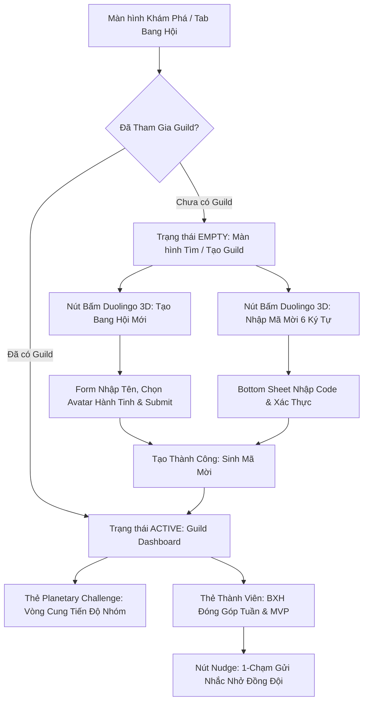

# Đặc Tả Thiết Kế Giao Diện UI/UX: Social Guilds & Planetary Challenges (Gate 2)

> **Dự án**: AstroBite (`astrobite`)  
> **Mã Epic / Feature**: `EPIC-14` / `FEAT-S21-GUILDS`  
> **Thiết kế bởi**: Sub-Agent UI/UX Designer — *The Celestial Aesthetic Purist*  
> **Hệ thống thiết kế**: Claymorphic × Duolingo 2D/3D Design System ([`DESIGN.md`](file:///Users/nguyenduytrang/flutter_project/AstroBite/DESIGN.md))  
> **Trạng thái**: 🟢 **GATE 2 APPROVED**

---

## 1. Sơ Đồ Luồng Người Dùng Trực Quan (Mermaid Flow)

---

## 2. Hệ Thống Màu Sắc & Tokens Ánh Xạ Chuẩn Xác (Design Tokens)

Tuân thủ nghiêm ngặt bảng màu trong `lib/core/theme/app_colors.dart`:
* **Nền tổng thể Canvas**: `AppColors.surface` (`#FAF8F5`) — Nền sữa ấm áp, thân thiện, không dùng nền xám đen u tối.
* **Bề mặt thẻ ClayCard**: `AppColors.surfaceContainer` (`#FFFFFF`) với bo góc **24pt**, đổ bóng kép:
  - Lớp 1 (Ambient): `BoxShadow(color: Color(0x0F000000), offset: Offset(0, 8), blurRadius: 16)`
  - Lớp 2 (Clay edge): `BoxShadow(color: Color(0x14000000), offset: Offset(0, 3.5), blurRadius: 0)`
* **Màu sắc dinh dưỡng & biểu tượng**:
  - 🥑 **Màu Tiến Độ Bang Hội**: `AppColors.brandGreen` (`#58CC02`) — Duolingo Lime Green tượng trưng cho sinh khí, sự gắn kết và hoàn thành mục tiêu.
  - 🩵 **Màu Chủ Đạo Tương Tác**: `AppColors.primary` (`#1CB0F6`) — Duolingo Sky Blue cho các nút bấm hành động chính (Tạo Bang, Sao chép mã mời).
  - 🧡 **Màu Điểm Năng Lượng**: `AppColors.tertiary` (`#FF9600`) — Honey Tangerine Orange cho Starlight XP và Huy hiệu MVP.
* **Tỷ lệ tương phản chữ**:
  - Tiêu đề & Tên Bang: `AppColors.onSurface` (`#1E2337`) — Deep Slate Berry (đạt chuẩn WCAG AAA > 13:1).
  - Mô tả & Thống kê phụ: `AppColors.onSurfaceVariant` (`#78829A`) — Cool Slate (đạt chuẩn WCAG AA > 4.8:1).

---

## 3. Screen Layout Blueprint Lưới 4pt (Công Thái Học Di Động)

### 3.1. Guild Dashboard Header
- Chiều cao: Tự co giãn theo nội dung, padding ngang 16pt, padding trên 12pt.
- Avatar Hành Tinh: Kích thước `64x64pt`, khung tròn bo viền nổi 3D, icon hành tinh lớn sinh động.
- Thông tin: Tên Bang (Font bold 20pt), Chip hiển thị số thành viên (VD: "8/20 Thành viên") màu pastel bạc hà `clayMint` (`#E8F9D8`).
- Nút Sao chép Mã mời: `ClayIconButton` nhỏ gọn 44x44pt với icon `Icons.copy_rounded`, bấm phát rung haptic nhẹ.

### 3.2. Thẻ Chiến Dịch Hành Tinh (Planetary Challenge Card)
- Bề mặt: `ClayCard` bo góc 24pt, padding 20pt.
- Header thẻ: Tiêu đề chiến dịch tuần (VD: "Chiến Dịch Sao Hỏa") + Huy hiệu số ngày còn lại (VD: "Còn 3 ngày").
- Tiến độ: Vòng cung tiến độ nhóm trung tâm kèm con số phần trăm lớn và tổng điểm (VD: `34,500 / 50,000 XP (69%)`).
- Thanh chỉ số: Hiển thị đóng góp cá nhân của bạn trong tuần (VD: "Bạn đã đóng góp: 450 XP").

### 3.3. Bảng Xếp Hạng Thành Viên (Guild Member List)
- Padding item: 12pt dọc, 16pt ngang, ngăn cách bởi đường rãnh nhẹ 8pt.
- Thứ hạng: 
  - Top 1: Huy hiệu vàng vương miện 👑 + nhãn `MVP`.
  - Top 2 & 3: Huy hiệu bạc và đồng.
- Thông tin thành viên: Avatar tròn 40pt, Tên hiển thị, Chuỗi streak (icon ngọn lửa cam 🔥 kèm số ngày).
- Nút Nudge: Nút tương tác 44x44pt bên phải, icon `Icons.notifications_active_outlined` màu xanh sky blue.

---

## 4. Chi Tiết 5 Trạng Thái Giao Diện Bắt Buộc (Mandatory 5 UI States)

1. **State 1: ACTIVE / DEFAULT**:
   - Dữ liệu tải đầy đủ, vòng cung chuyển động mượt mà khi mở màn hình (TweenAnimationBuilder 800ms với đường cong `Curves.easeOutBack`).
2. **State 2: SHIMMER / LOADING**:
   - Sử dụng `ClaySkeletonLoader` mô phỏng Avatar hình tròn, thẻ Card lớn hình chữ nhật bo góc 24pt và 3 hàng placeholder thành viên với hiệu ứng quét ánh sáng nhẹ êm ái.
3. **State 3: EMPTY**:
   - Khi người dùng chưa có Bang hội:
     - Minh họa phi thuyền du hành vũ trụ thân thiện.
     - Dòng chữ: *"Bạn chưa tham gia Bang Hội nào"*.
     - 2 Nút bấm Duolingo 3D lớn:
       1. **[Tạo Bang Hội Của Riêng Bạn]** (Nền Sky Blue `#1CB0F6`, độ dày đáy 4pt).
       2. **[Nhập Mã Mời Gia Nhập]** (Nền trắng viền nổi, độ dày đáy 3pt).
4. **State 4: ERROR**:
   - Khi mạng mất kết nối hoặc mã mời không tìm thấy:
     - Card thông báo bo góc 20pt, viền đỏ dâu tây pastel `claySnack` (`#FFE8EE`).
     - Nút "Thử lại ngay" với cảm ứng tactile squash khi ấn (scale 0.98).
5. **State 5: OFFLINE**:
   - Hiển thị badge nhỏ góc trên: `Đang xem ngoại tuyến - Điểm sẽ đồng bộ khi có mạng`.
