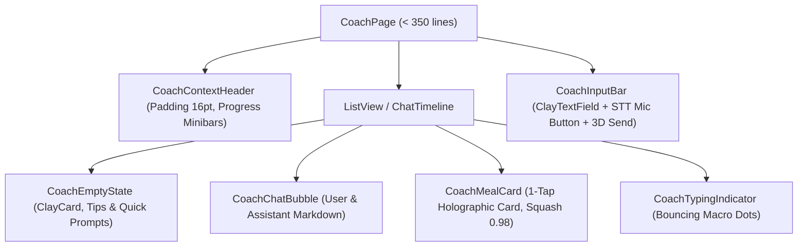
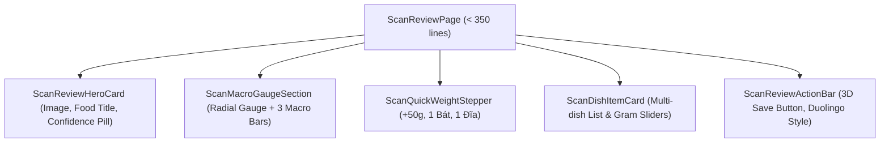

# UI/UX Layout Blueprint: AI Coach & Scan Review (Sprint 23)

- **Sub-Agent**: `ui-ux-designer`
- **Design Tokens**: Celestial Dark & Puffy Claymorphism (4pt spacing grid, 20pt card corner radius, WCAG AAA)
- **Status**: 🟢 **Gate 2 Design Sign-Off**

---

## 🎨 1. Sơ Đồ Cấu Trúc Thành Phần Màn Hình AI Coach

### Chi Tiết Kích Thước & Spacing 4pt:
- **`CoachContextHeader`**: Margin top 8pt, padding horizontal 16pt, vertical 12pt, bo góc 20pt.
- **`CoachChatBubble`**: Padding 14pt, bo góc 18pt, đuôi bong bóng offset 4pt. User bubble nền `AppColors.primary`, Assistant bubble nền `AppColors.surfaceContainer`.
- **`CoachMealCard`**: Bo góc 20pt, viền Clay border `outline`, nút 1-Tap Log cao 48pt với hiệu ứng bóng 3D bevel 3.5pt.
- **`CoachInputBar`**: Nền trắng đục/clay, padding 12pt, mic icon 44x44pt chuẩn công thái học.

---

## 🎨 2. Sơ Đồ Cấu Trúc Thành Phần Màn Hình Scan Review

### Chi Tiết Kích Thước & Spacing 4pt:
- **`ScanReviewHeroCard`**: Hero Image bo góc 20pt, độ cao 200pt, confidence badge bo tròn 16pt.
- **`ScanMacroGaugeSection`**: Vòng tròn Radial Gauge đường kính 140pt, 3 thanh macro cao 12pt với nhãn 11pt.
- **`ScanDishItemCard`**: Chiều cao linh hoạt, padding 16pt, slider bo tròn với thumb 24x24pt.
- **`ScanReviewActionBar`**: Nút lưu 3D Duolingo chiều cao 52pt, bevel 4pt, màu xanh chủ đạo `AppColors.primary`.
