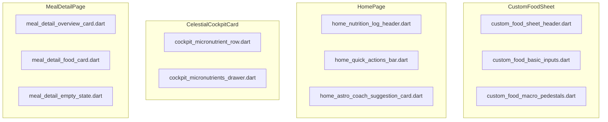

# UI Design Blueprint: Sprint 28 Tracker & Dashboard (Gate 2)

- **Tác giả**: Sub-Agent UI/UX Designer (*"The Celestial Aesthetic Purist"*)
- **Chuẩn thiết kế**: Claymorphic × Duolingo 2D/3D (Lưới 4pt, Warm Milk Canvas, 2-layer floating shadows)

---

## 1. Kiến Trúc Khối Giao Diện

---

## 2. Quy Cách Lưới & Tokens

- **Góc bo**: `16pt` cho các input cards con, `20pt` cho cards gợi ý, `24pt` cho Cockpit Card và Submit buttons.
- **Bảng màu Dinh dưỡng Bất biến**:
  - Carbs: Sky Blue `#1CB0F6` (Duolingo Sky)
  - Protein: Orange `#FF9600` (Honey Tangerine)
  - Fat: Pink `#FF5C8D` (Strawberry Cream)
  - Calories: Lime Green `#58CC02` / Sky Blue `#1CB0F6`
