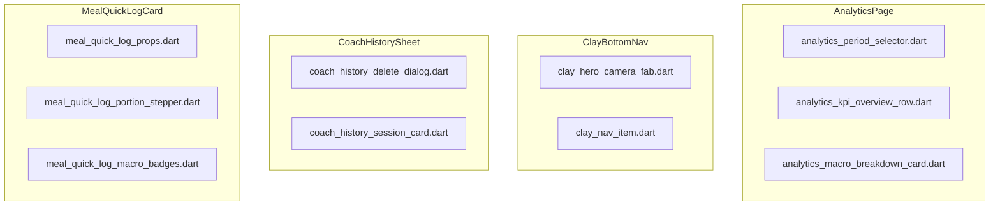

# UI Design Blueprint: Sprint 29 Deep Clean Polish (Gate 2)

- **Tác giả**: Sub-Agent UI/UX Designer (*"The Celestial Aesthetic Purist"*)
- **Chuẩn**: Claymorphic × Duolingo 2D/3D (Lưới 4pt, Warm Milk Canvas, tactile squash, 2-layer floating shadows)

---

## 1. Bản Đồ Phân Rã Khối Giao Diện

---

## 2. Token & Hằng Số UI
- Dock height: `64pt`, Hero FAB: `56pt`, Cradle size: `64pt`.
- Góc bo: `16pt` cho input/steppers, `18pt` cho KPI cards, `20pt` cho Charts, `24pt` cho Period Selector & Sheet top radius.
