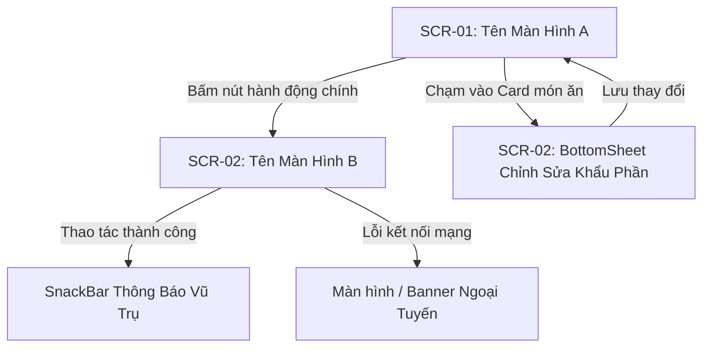

# Đặc Tả Thiết Kế Giao Diện (UI/UX Design Spec): [Mã & Tên Tính Năng]

> **Biểu mẫu chuẩn hóa**: `docs/templates/template-ui-ux-spec.md`  
> **Thuộc Cổng**: Gate 2 (Mobile UI/UX Design Gate)  
> **Sub-Agent Thiết kế**: `ui-ux-designer`  
> **Tài liệu tham chiếu**: PRD (`prd-[feature].md`), User Stories (`user-stories.md`), Design System ([`DESIGN.md`](file:///Users/nguyenduytrang/flutter_project/AstroBite/DESIGN.md))  
> **Trạng thái**: 🟡 Đang thiết kế / 🟢 Đã nghiệm thu Gate 2  

---

## 1. Danh Sách Màn Hình & Sơ Đồ Điều Hướng (Navigation Flow)

### 1.1. Bảng Danh Mục Màn Hình & Thành Phần UI
| Mã Màn Hình | Tên Màn Hình / Dialog / Sheet | Tuyến Đường (AutoRoute) | Mục Đích & Bối Cảnh Sử Dụng |
| :---: | :--- | :--- | :--- |
| `SCR-01` | [Ví dụ: MultiItemScanResultScreen] | `/[route-path]` | [Mô tả mục đích hiển thị cho người dùng] |
| `SCR-02` | [Ví dụ: EditPortionBottomSheet] | `modal bottom sheet` | [Mô tả mục đích hiển thị cho người dùng] |

### 1.2. Sơ Đồ Luồng Tương Tác Người Dùng (Mermaid Navigation Flow)

---

## 2. Blueprint Bố Cục & Thông Số Lưới 4pt (Screen Layout Blueprints)

### 2.1. Cấu Trúc Bố Cục Màn Hình (`SCR-01: [Tên Màn Hình]`)
- **Khung viền màn hình (Edge Margins)**: `16pt` (hoặc `24pt` cho Auth/Onboarding).
- **Thanh tiêu đề (Top AppBar)**:
  - Chiều cao chuẩn: `56pt`.
  - Icon điều hướng (Back / Close): `24x24pt` bên trong vùng chạm `44x44pt`.
  - Tiêu đề màn hình: Font Inter Bold `20pt` (`headlineMedium`), màu `AppColors.onSurface` (`#FFFFFF`).
  - Actions bên phải: Icon hành động phụ `24pt` với padding bảo đảm `>= 44x44pt`.
- **Thân nội dung cuộn (Scrollable Body)**:
  - Khoảng cách giữa các khối container (Gutter): `16pt`.
  - Khoảng cách giữa các dòng thông tin con: `8pt` hoặc `12pt`.
  - Padding bên trong Card (Internal Card Padding): `16pt`.
- **Vùng hành động cố định (Bottom Action Area)**:
  - Nút bấm chính (CTA Button): Chiều cao `52pt`, bo góc `16pt`, chữ `16pt` SemiBold, full-width trừ padding 2 bên `16pt`.
  - Vùng an toàn đáy: Luôn bọc trong `SafeArea(bottom: true)`.

### 2.2. Kiểm Soát Vùng Chạm Công Thái Học (Touch Targets Checklist)
- [ ] Tất cả nút bấm, icon bấm được, chip chọn lựa đều có kích thước bounding box `>= 44 × 44pt`.
- [ ] Các thành phần tương tác chính bố trí thuận tiện cho thao tác một tay bằng ngón cái (Thumb Zone).

### 2.3. Thang Phân Cấp Kiểu Chữ (Typography Hierarchy)
- **Tiêu đề lớn / Metric quan trọng**: Font Inter Bold `24pt+`, `letterSpacing: +0.5`.
- **Tiêu đề nhóm / Card Header**: Font Inter Medium `16pt` (`titleMedium`), màu `onSurface` (`#FFFFFF`).
- **Nội dung / Mô tả món ăn**: Font Inter Regular `14pt` (`bodyMedium`), màu `onSurfaceVariant` (`#8892B0`).
- **Ghi chú nhỏ / Micro-copy / Thời gian**: Font Inter Medium `12pt` (`labelMedium`), màu `outline` (`#495670`).

---

## 3. Đặc Tả 5 Trạng Thái Giao Diện Bắt Buộc (The 5 Essential States)

Mỗi màn hình bắt buộc phải xác định rõ ràng hành vi hiển thị qua 5 trạng thái:

| Trạng Thái | Mô Tả Hành Vi Giao Diện | Quy Chuẩn Trực Quan (Visual Specs) |
| :--- | :--- | :--- |
| **1. Default (Dữ liệu đầy đủ)** | Hiển thị trọn vẹn danh sách và số liệu sau khi tải thành công. | Sử dụng Card `AppColors.surfaceContainer`, văn bản rõ nét tương phản cao. |
| **2. Loading (Đang tải / Xử lý)** | Hiển thị Skeleton Shimmer khi đang đợi mạng hoặc Gemini AI. | Shimmer chu kỳ lặp 1.5s, màu khối `#112240` ➔ `#1A2F50` ➔ `#112240`, giữ nguyên kích thước bố cục (Zero Layout Shift). Không dùng spinner đơn điệu chắn màn hình. |
| **3. Empty (Chưa có dữ liệu)** | Hiển thị khi người dùng chưa có nhật ký hoặc danh sách trống. | Icon minh họa chủ đề thiên hà (Galaxy illustration), dòng thông điệp hướng dẫn ngắn gọn ("Chưa có dữ liệu bữa ăn hôm nay"), kèm nút CTA ("Quét món ăn ngay"). |
| **4. Error / Exception (Lỗi hệ thống)** | Hiển thị khi gặp lỗi mạng, quá hạn AI quota, hoặc lỗi server. | Viền màu cảnh báo nhẹ, thông báo lỗi tiếng Việt thân thiện rõ ràng (không hiện raw code), kèm nút bấm "Thử lại" (`44pt` min height). |
| **5. Offline (Ngoại tuyến)** | Hiển thị khi thiết bị ngắt kết nối Internet đột ngột. | Banner mờ ở cạnh trên (`AppColors.surfaceBlur`) ghi rõ "Đang xem dữ liệu ngoại tuyến", các thao tác mới hiển thị huy hiệu "Chờ đồng bộ". |

---

## 4. Bảng Ánh Xạ Token Celestial Dark UI (Design Token Mapping)

| Thành Phần Giao Diện | M3 Token / AppColors | Hex / RGB | Mục Đích Dinh Dưỡng & Ngữ Nghĩa |
| :--- | :--- | :--- | :--- |
| Nền toàn ứng dụng | `AppColors.surface` | `#0A192F` | Bầu trời đêm sâu thẳm, dịu mắt trong bóng tối |
| Thẻ thông tin / Meal Card | `AppColors.surfaceContainer` | `#112240` | Khối thẻ nổi bật, bo góc 12px |
| Lớp phủ mờ / Bottom Sheet | `AppColors.surfaceBlur` | `rgba(25, 42, 70, 0.6)` | Kính mờ với `BackdropFilter.blur(20)` |
| Đường viền / Phân cách | `AppColors.outline` | `#495670` | Viền nhẹ, vạch chia grid đồ thị |
| **Carbs Indicator / Primary CTA** | `AppColors.primary` | `#1A73E8` | **Chỉ số Tinh bột**, nút bấm chính, Camera FAB |
| **Fat Indicator / Analytics Trend** | `AppColors.secondary` | `#FF69B4` | **Chỉ số Chất béo**, đường cong phân tích |
| **Protein / Calorie Alert** | `AppColors.tertiary` | `#FFD700` | **Chỉ số Đạm**, cảnh báo calo vượt ngưỡng |

---

## 5. Handoff Specs & Kỷ Luật Ponytail Cho Dev FE

> [!IMPORTANT]
> Dev FE bắt buộc phải tái sử dụng các component có sẵn trong `shared/widgets/`, tuyệt đối không tạo thêm widget thừa.

### 5.1. Danh Sách Reusable Widgets Bắt Buộc Sử Dụng
- `GlassCard`: Sử dụng cho mọi container nổi có hiệu ứng kính mờ và viền ánh sao.
- `MacroBar`: Sử dụng để biểu thị thanh tỷ lệ Carbs (Xanh), Fat (Hồng), Protein (Vàng).
- `CalorieProgressArc`: Sử dụng cho vòng tròn tiến độ calo trong ngày.
- `MealTypeChip`: Sử dụng cho bộ chọn bữa ăn (Sáng, Trưa, Tối, Snack).
- `SkeletonLoader`: Sử dụng cho mọi trạng thái Loading dạng shimmer.

### 5.2. Chỉ Dẫn Kỹ Thuật Flutter Cho Dev FE
- Loại bỏ màu ám tím: Luôn thiết lập `surfaceTintColor: Colors.transparent`.
- Bo góc chuẩn: Card dùng `BorderRadius.circular(12)`, Button dùng `BorderRadius.circular(16)`.
- Định dạng số: Số calo luôn có thuộc tính `letterSpacing: 0.5`.

---

## 6. Biên Bản Thẩm Định & Ký Duyệt Cổng 2 (Gate 2 Sign-Off)

Biên bản này được ký bởi 2 cặp mắt độc lập (Four-Eyes Principle) trước khi chuyển giao cho PM, QA và Dev FE:

### 6.1. Checklist Đối Soát Nghiệp Vụ (Sub-Agent `business-analyst`)
- [ ] Đã bao phủ 100% các User Stories được duyệt trong `user-stories.md`.
- [ ] Tất cả các trường dữ liệu và ràng buộc validation trong PRD đều có phần tử UI tương ứng.
- [ ] Các thông báo lỗi thân thiện khớp với từ điển dữ liệu và kịch bản BDD.
- **Ý kiến BA**: *[Ghi chú đánh giá của BA]*

### 6.2. Checklist Nghiệm Thu Trải Nghiệm & Thẩm Mỹ (Sub-Agent `product-owner`)
- [ ] Thiết kế tuân thủ 100% phong cách **Celestial Dark UI** và hệ thống màu dinh dưỡng bất biến.
- [ ] Lưới khoảng cách 4pt và kích thước vùng chạm 44pt công thái học đạt chuẩn.
- [ ] Đủ 5 trạng thái giao diện, đặc biệt trạng thái Shimmer và Offline rõ ràng.
- **Ý kiến PO**: *[Ghi chú đánh giá của PO]*

### 6.3. Kết Luận & Chữ Ký Nghiệm Thu
- **Phán quyết**: 🟢 **Passed Gate 2 — Ready for QA & Dev FE**
- **Đại diện BA**: `Sub-Agent business-analyst` — Ngày ký: `YYYY-MM-DD`
- **Đại diện PO**: `Sub-Agent product-owner` — Ngày ký: `YYYY-MM-DD`
